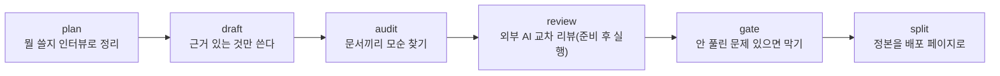

# docloop

English: [README.md](README.md)

**기획 문서를 쓰면, 리뷰어보다 먼저 docloop이 어긋난 곳을 잡아준다.**
PRD·정책서·변경계획을 쓰고 나서 터미널에서 docloop을 돌린다. 이미 쓰는 AI CLI(`codex`
또는 `claude -p`)는 docloop이 대신 구동하고, 문서에는 당신이 승인한 내용만 반영된다.

> 속은 이렇다: 검증 가능한 것만 점검해 빈틈을 드러내고 멈춘다 — 판단은 사람의 몫이다.
> 이 방식의 이름이 **검증 우선 문서 커널**이다. 왜 그런지는: [`docs/design.md`](docs/design.md).

## 뭘 할 수 있나

- **PRD·스토리보드·매뉴얼이 서로 어긋난 곳을 리포트로 받는다** — `audit`가 문서들을 대조해 모순을 보고한다.
- **변경계획의 as-is 주장마다 근거가 실제로 있는지 확인한다** — 출처 없는 주장은 계획을 넘기기 전에 걸린다(변경계획 모드).
- **인용이 원본과 달라지면 잡는다** — 별도의 동반 검사가 인용을 출처와 대조해(띄어쓰기 차이는 무시) 어긋난 것을 표시한다.
- **외부 AI가 초안을 공격하게 하고, 반영은 당신이 승인한 것만** — 지적마다 번호가 붙고 반영/기각을 정한다.
- **명시적으로 요청할 때 더 엄격한 3렌즈 리뷰 패킷을 준비한다** — `review-gate`가 리뷰할 파일 하나와 결정 이력·결정론 입력을 동결하고, 모델 실행과 최종 판단은 사람에게 남긴다.
- **선택한 직무 관점을 초안 전에 따로 모은다** — `contribute`가 추적 가능한 제안을 별도 기록하고, 사람이 결정·자료를 보충한 뒤 `curate`가 검증된 선택 입력으로 정리한다.
- **정본 문서를 컨플루언스 등에 올릴 페이지로 쪼갠다** — `split`이 하나뿐인 정본에서 페이지를 잘라낸다. 배포본은 언제든 재생성.

## 시작하기

### 설치

```bash
git clone https://github.com/kaidomo/docloop && cd docloop
# 선택: 기존 릴리즈에 설치 버전 고정(예: git checkout v0.12.0)
pip install -r requirements.txt       # 점검기가 쓰는 라이브러리 하나(PyYAML)
chmod +x bin/docloop
export PATH="$PWD/bin:$PATH"          # 이 터미널 세션에서 docloop 사용(유지하려면 이 줄을 셸 프로필에 추가)
export DOCLOOP_MODEL=codex            # docloop이 구동할 AI CLI: codex 또는 claude
docloop --version                     # 제품 릴리즈 버전 출력
```

필요 사항: Python 3 + PyYAML, 그리고 `codex` 또는 `claude` CLI 중 하나가 PATH에 있어야 한다.
`DOCLOOP_MODEL=claude`에서 선택형 `contribute`를 쓸 때는 Claude Code의
`--safe-mode`와 `--json-schema` 옵션이 필요하다(2.1.220에서 확인). 평범한 `plan`과
`draft`의 Claude 호출은 기존 그대로다. 새 `draft-curated`는 비대화형 `acceptEdits`
모드에서 `Read`, `Glob`, `Grep`, `Edit`, `Write`만 허용하며 shell 실행 도구는 주지
않는다.

### 빠른 시작

```bash
docloop init ~/work/case-submission ./submission-policy.md   # 작업 폴더 생성(전달한 입력 파일은 그 안의 inputs/로 이동된다)
cd ~/work/case-submission
cp /path/to/docloop/templates/policy.example.yaml ./policy.yaml   # 조직 규칙은 policy.yaml 한 파일 — 맞게 수정

docloop plan  "케이스 제출 흐름 PRD"                # 짧은 인터뷰로 뭘 쓸지 합의
docloop draft                                       # 출처가 뒷받침하는 것만 쓴다
docloop audit                                       # 문서끼리 모순 찾기
docloop review case-submission ./PRD_*.md           # 외부 AI 교차 리뷰 준비(다음 단계로 공격 실행을 안내)
docloop gate                                        # 최종 검사: 안 풀린 문제가 있으면 막는다
docloop split                                       # 정본을 배포 페이지로 쪼갠다
```



### 선택 사항: 초안 전에 관점 기여 받기

위의 기본 `plan → draft` 경로는 그대로다. 여러 관점을 명시적으로 먼저 받고 싶을
때만 다음 별도 분기를 추가한다.

```bash
docloop contribute cc-20260803-01 pm qa backend
cp work/contributions/cc-20260803-01/payload/human-response.template.yaml \
  work/contribution-responses/cc-20260803-01.yaml
# 복사본에서 모든 처분을 기록하고 inputs/ 아래 자료를 추가한 뒤 attestation을 채운다.
docloop curate cc-20260803-01 cur-20260803-01 \
  work/contribution-responses/cc-20260803-01.yaml
docloop draft-curated cur-20260803-01
```

각 단계는 선택형이다. `contribute`와 `curate`는 다음 단계를 자동 호출하지 않고,
평범한 `docloop draft`는 bundle을 찾아 쓰지 않는다. 각 관점 호출은 동일하게 캡처된
입력 바이트를 받고 별도 산출물을 만들지만 격리되거나 독립된 agent가 아니며, 전문성·
정확성·완전성·합의를 보장하지 않는다. bundle에는 입력, 모델 출력, 사람의 판단,
보충 자료의 복사본이 남고 설정한 provider가 source 내용을 받을 수 있다. 답변 schema,
Codex 기여 호출은 read-only sandbox를, curated 초안 호출은 workspace-write를 요청하지만
이 provider 설정을 격리 보장으로 주장하지 않는다.
accepted-state 검증, 제한, privacy, 동시 실행, 수동 보존·삭제는
[기여·큐레이션 가이드](docs/contribute-curate.md)를 참고한다.

### 선택 사항: review-gate 패킷 준비

`docloop review`로 폴더를 준비한 뒤, UTF-8 대상 파일 하나와 선택한 리뷰 입력을
명시적으로 동결해 3렌즈 패킷을 만들 수 있다.

```bash
docloop review-gate prepare ~/.docloop/reviews/case-submission rg-20260803-01 PRD.md \
  --decisions decisions.yaml --terms terms.yaml --no-docmodel \
  --editing-state frozen --target-maturity complete
docloop review-gate check \
  ~/.docloop/reviews/case-submission/review-gate/rg-20260803-01
docloop review-gate validate-result \
  ~/.docloop/reviews/case-submission/review-gate/rg-20260803-01 results/DONE.md
```

이 명령은 프롬프트와 결정론적 감사 산출물을 준비할 뿐 모델을 호출하거나 finding을
반영하거나 문서를 reviewed로 표시하지 않는다. Git 저장소가 아닌 리뷰 폴더도 지원하며,
UTF-8 대상 파일 하나를 동결한다. 패킷 내부 경로는 정규화된 packet-relative POSIX
경로여야 하고 symlink가 아닌 정규 파일만 허용한다. 패킷과 draft 출력은
exclusive/no-follow/no-clobber 방식으로 만들어 기존 파일이나 패킷 밖 경로를 덮어쓰지
않는다.

생성된 렌즈·합성·앵커 감사·검증 프롬프트를 fresh context에서 실행하고, 마지막 판단을
사람이 기록한다. v2 중간 원장은 source candidate → atom → terminal record 계보를
보존한다. 모든 source candidate는 하나 이상의 atom으로 이어지고, 하나의 atom이 여러
candidate를 병합할 수도 있으며, 각 atom은
`finding | question | drift | suppressed | nonissue` 중 정확히 하나로 분류된다. `drift`는
같은 대상을 같은 값으로 표현한 non-blocking 표기 차이이며 finding이 아니다. 권위 있는
답이 없는 question은 원장 closure를 막는다. 사람은 각 finding을 승인하거나 기각하고,
적용 결과를 검증한 뒤 최종 판단을 기록한다.

v2 receipt의 `packet_binding`은 `run_id`, `target_source`, `target_snapshot`,
`prepared_payload_digest_sha256`, `receipt_path`의 정확한 5개 필드로 구성된다.
`validate-result`는 receipt를 읽기 전에 prepared packet 무결성을 검사하고, 다른 run의
binding, 변경된 ledger 바이트, 닫힌 원장과 다른 공개 receipt record, 안전하지 않은
receipt·ledger 경로를 거부한다. receipt 본문 전체 바이트를 해시 결합하는 것은 아니다.
`schema_version: 1` receipt는 이제 done으로 검증될 수 없다 — input gate가 도입되기 전의
형식이기 때문이다. 이미 닫힌 v1 receipt를 확인하려면 `--legacy`를 쓴다(필드 완전성만
확인할 뿐 판정은 아니다).

`prepare`는 `--editing-state`/`--target-maturity`도 요구하며(대상이 draft이거나 maturity가
unknown이면 `--open-items-ledger`도 필요), 모든 렌즈를 내부 순서 guard로 통과시켜 그
CONTRACT §1 input gate를 기록하고 결과를 `deterministic/FRONT_GATE_TRACE.json`에
동결한다 — 이 trace는 해시로 결합되며 done receipt의 `front_gate_ref`가 요구한다. 이를 위한
별도의 공개 명령은 아직 없으며, trace는 오직 `prepare`만 생성한다. 선택적
`--convention-profile FILE --convention-intake FILE` 쌍은 run 디렉터리를 예약하기 전에
profile과 pre-lens 답변을 검증한다. `materialize-docmodel`은 `approved_to_draft` 답만
사용해 `approval_state: draft`, `approved_by: null`, `suppression_eligible: false`인 새
draft를 만든다. 이 draft는 현재 run의 L3 입력이나 suppression authority로 자동 인정되지
않으며, 사람이 승인한 뒤 이후 run에서 명시적으로 선택해야 한다 — 그리고 docauth#242 이후로
`approved_docmodel` authority 참조는 docmodel 파일 스스로의 주장이 아니라 독립적인
`docmodel-approvals.yaml` registry 항목에 결합된다. 전체 input-gate·front-gate-trace·
docmodel-approvals 계약은 [review-gate 가이드](docs/review-gate.md)를 참고한다.

`review-gate check`와 receipt 검증은 경로·파일 종류·해시·run binding 같은 기계적
불변식을 확인할 뿐 리뷰 통과를 선언하지 않는다. finding이 맞는지, 모든 문제를 찾았는지,
작성자가 누구인지, 같은 UID 권한으로 packet과 metadata를 함께 다시 쓴 공격을 막았는지는
증명하지 않는다. 렌즈 폴더도 입력 envelope이지 파일시스템 격리나 독립 agent의 증명이
아니다. 현재 범위는 run당 대상 문서 하나이며 다중 문서/docmodel 일반화는 유보한다.
전체 명령, 입력 선택, 산출물, 실패 동작, 수동 완료 계약은
[review-gate 가이드](docs/review-gate.md)를 참고한다.

## 한계

- 찾는 건 AI 모델이다 — `audit`·`review`·`panel` 리포트는 판정이 아니라 눈 밝은 검토 보조로 쓴다.
- docloop은 당신이 고른 출처와 문서를 대조할 뿐, 그 출처가 참임을 증명하지 않는다.
- 기여 답변의 attestation은 자기 확인일 뿐 사람의 신원·작성자·권한을 인증하지 않는다.
- `review-gate` 무결성 검사는 경로·해시·run 결합을 검증하지만 finding의 의미적 정확성·완전성·작성자를 증명하지 않는다.
- 검사 후 `split` 순서는 워크플로이지 도구가 강제하지 않는다 — 최종 판단은 언제나 사람의 몫이다.

## 더 알아보기

- [`docs/change-plan-mode.md`](docs/change-plan-mode.md) — 이미 있는 시스템의 수정을 계획하는 as-is/to-be 파이프라인(`atb-*`).
- [`docs/panel-and-lock.md`](docs/panel-and-lock.md) — 초안을 여러 직무 관점에서 한 번에 검토받고(`panel`), 결과가 나오기 전에 예측을 못 박아 둔다(`lock` / `verify`).
- [`docs/contribute-curate.md`](docs/contribute-curate.md) — 관점 기여를 선택적으로 모으고 사람의 결정·자료를 보충해 검증된 초안 입력으로 넘기는 흐름.
- [`docs/review-gate.md`](docs/review-gate.md) — 동결된 3렌즈 리뷰 패킷을 명시적으로 준비하고 합성·검증·사람 처분을 수동으로 마치는 흐름.
- [`docs/policy-layer.md`](docs/policy-layer.md) — 조직 문서 규칙을 담는 한 파일(`policy.yaml`).
- [`docs/direction.md`](docs/direction.md) — 지금 안에 있는 것, 그리고 계획이지만 미출시인 것.
- [`docs/design.md`](docs/design.md) — 왜 문서에는 검증 커널이 필요한가, docloop이 긋는 선.
- [`docs/releasing.md`](docs/releasing.md) — 공개 태그를 이동하지 않고 릴리즈를 준비·검증·태그하고 실패를 복구하는 방법.

## 라이선스

MIT — [LICENSE](LICENSE) 참고.
