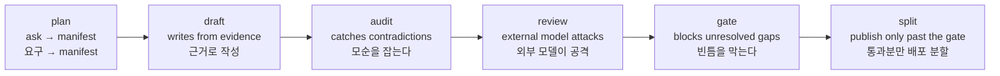

# docloop

**A verification-first document kernel** — mechanical gates and model-assisted audits
for documents (PRDs, specs, policies, change plans), wrapped around a model CLI you
already use (`codex` or `claude -p`). The authoring layer is a client of the kernel,
not the kernel itself.
**검증 우선 문서 커널** — 문서(PRD·명세서·정책서·변경계획)를 위한 기계 게이트와 모델 보조
감사를, 이미 쓰는 모델 CLI(`codex` 또는 `claude -p`) 위에 얹는다. 저작(글쓰기) 레이어는
커널의 클라이언트이지 커널 자체가 아니다.

> **Writing has no single oracle** — so docloop is built the other way around: check what
> can be checked (source-grounded accuracy, consistency, policy), surface the gaps, and
> stop; judgment stays with the human. The kernel is the checking layer; authoring flows
> are clients built on it.
> **글에는 단일 오라클이 없다** — 그래서 docloop은 반대 방향으로 지어졌다. 검증 가능한 것
> (출처 대비 정확성·정합·정책)만 점검해 빈틈을 드러내고 멈춘다. 판단은 사람의 몫이다.
> 커널은 점검 레이어이고, 저작 플로우는 그 위에 지어진 클라이언트다.

## What you can do · 뭘 할 수 있나

- **Get a contradiction report across your PRD, storyboard, and manual** — gap-audit
  fans out and reports where documents disagree (model-assisted).
  <br>**PRD↔스토리보드↔매뉴얼의 불일치를 리포트로 받는다** — gap-audit이 팬아웃으로 문서 간
  어긋남을 보고한다(모델 보조).
- **Audit whether every as-is claim in a change plan has real evidence** — an as-is with
  no source is blocked by ground-audit (change-plan mode).
  <br>**변경계획의 as-is 주장마다 증거가 실존하는지 감사한다** — 출처 없는 as-is는
  ground-audit이 막는다(변경계획 모드).
- **Catch a quote that drifts from its source by even one character** — verbatim
  comparison feeds the release gate.
  <br>**인용이 출처와 한 글자라도 다르면 잡는다** — verbatim 대조가 릴리스 게이트로 이어진다.
- **Have an external model attack your draft, and apply only what you approve** — the
  review loop runs on finding IDs, triage, and a human approval gate.
  <br>**외부 모델이 초안을 공격하고, 반영은 사람이 승인한 것만** — review 루프는 finding
  ID·triage·사람 승인 게이트로 돈다.
- **Get independent job-role reviews with conflicts preserved** — `panel` runs each role
  as its own process; the Area Chair synthesis never averages or majority-votes.
  <br>**직무 역할들이 독립적으로 뜯어본다(충돌 보존)** — `panel`은 역할마다 별도 프로세스로
  돌리고, Area Chair 합성은 평균·다수결을 쓰지 않는다.
- **Make "I knew it" falsifiable** — `lock` seals a prediction before the outcome exists;
  `verify` re-hashes at reveal (diagnostic-only).
  <br>**"그럴 줄 알았다"를 반증 가능하게 만든다** — `lock`이 결과가 나오기 전에 예측을
  봉인하고, `verify`가 공개 시점에 재해시한다(진단 전용).
- **Ship only what passes the release gate** — `split` regenerates publish pages from
  the SSOT.
  <br>**릴리스 게이트 통과분만 배포 페이지로 분할한다** — `split`이 SSOT에서 배포 페이지를
  재생성한다.

## Install · 설치

```bash
git clone https://github.com/kaidomo/docloop && cd docloop
pip install -r requirements.txt       # PyYAML (used by the lib/ scripts)
chmod +x bin/docloop
export PATH="$PWD/bin:$PATH"          # or symlink bin/docloop onto your PATH
export DOCLOOP_MODEL=codex            # or: claude   (default: codex)
```

Requirements: Python 3 + PyYAML (`pip install -r requirements.txt`), and one of the
`codex` or `claude` CLIs on your PATH.
필요 사항: Python 3 + PyYAML, 그리고 `codex` 또는 `claude` CLI 중 하나가 PATH에 있어야 한다.

## Quick start · 빠른 시작

```bash
docloop init ~/work/case-submission ./submission-policy.md   # scaffold + isolate inputs
cd ~/work/case-submission
cp /path/to/docloop/templates/policy.example.yaml ./policy.yaml   # edit to your house style

docloop plan  "PRD for the case submission flow"   # interview -> manifest
docloop draft                                       # write grounded sections
docloop audit                                       # find contradictions, report
docloop review case-submission ./PRD_*.md           # attention test: external-model cross-review
docloop gate                                        # release gate (strict)
docloop split                                       # regenerate publish pages
```



## What's inside · 안에 있는 것

docloop adds **no new runtime and no new agent.** The value is in three things:
docloop은 **새 런타임도 새 에이전트도 만들지 않는다.** 가치는 세 가지에 있다:

1. **The checks & gates** (`lib/`) — fan-out audits (model-assisted: gap-audit for
   consistency, ground-audit for evidence grounding) feeding deterministic manifest
   validation, release gates, verbatim comparison, and prediction-file integrity
   (lock/verify; diagnostic-only). Deterministic where applicable; otherwise fail-honest.
   <br>**점검기와 게이트** (`lib/`) — 팬아웃 감사(모델 보조: 정합의 gap-audit, 증거 근거성의
   ground-audit)가 결정론적 manifest 검증·릴리스 게이트·verbatim 대조·예측 파일 무결성
   확인(lock/verify, 진단 전용)으로 이어진다. 가능한 점검은 결정론적으로 수행하고, 그렇지
   않은 점검은 성공을 가장하지 않고 한계를 드러낸다.
2. **The review protocols** — external-model cross-review (`prompts/review.md`: finding
   IDs, triage, a human approval gate, explicit termination states) and role-panel review
   (`panel`: independent role runs, Area Chair synthesis, human decision handoff).
   <br>**리뷰 프로토콜** — 외부 모델 교차 리뷰(`prompts/review.md`: finding ID·triage·사람
   승인 게이트·명시적 종료 상태)와 역할 패널 리뷰(`panel`: 독립 역할 실행·Area Chair 합성·
   사람 결정 핸드오프).
3. **The authoring pipelines** (`prompts/`) — the authoring layer is a client of the
   kernel; it currently contains two pipelines: doc mode (plan → draft → audit → review →
   gate → split) and change-plan mode (`atb-*`).
   <br>**저작 파이프라인** (`prompts/`) — 저작 레이어는 커널의 클라이언트이며, 현재 두
   파이프라인을 담는다: 문서 모드(plan → draft → audit → review → gate → split)와
   변경계획 모드(`atb-*`).

## Why documents need a verification kernel (not just a writing loop) · 왜 문서에는 (글쓰기 루프가 아니라) 검증 커널이 필요한가

Coding loops converge because code has an **oracle** — the compiler and the tests say,
objectively, "still wrong." Writing has none: there is no compiler for a PRD, so a naive
"write → self-check → rewrite" loop just converges on its own confident prose. docloop's
core is a verification kernel because it splits the problem: what *can* be checked
(source-grounded accuracy, consistency, policy) runs in loops with real checks plus an
external model as independent pressure — an *attention* test, not a *truth* test — while
voice, judgment, and the actual decisions stay outside the loop, with the human. The
kernel detects drift from the sources you selected and stops; it does not prove those
sources true, and it never manufactures consensus.
코딩 루프가 수렴하는 것은 코드에 **오라클**이 있기 때문이다 — 컴파일러와 테스트가 "아직
틀렸다"를 객관적으로 말해 준다. 글에는 그것이 없다. PRD를 위한 컴파일러는 없으므로, 단순한
"작성 → 자가검토 → 재작성" 루프는 스스로 확신에 찬 문장으로 수렴할 뿐이다. docloop의 core가
검증 커널인 이유는 문제를 쪼개기 때문이다: 검증 *가능한* 것(출처 대비 정확성·정합·정책)은
실제 점검과 외부 모델의 독립적 압력(정답 판정이 아니라 주의환기 점검)이 있는 루프로 돌리고,
문체·판단·실제 의사결정은 루프 밖 사람의 몫으로 남긴다. 커널은 선택한 출처로부터의
드리프트를 잡고 멈출 뿐, 출처가 참임을 증명하지도 않고 합의를 지어내지도 않는다.

See [`docs/design.md`](docs/design.md) for the full argument.
전체 논의는 [`docs/design.md`](docs/design.md)에서 다룬다.

## Where docloop draws the line · docloop이 긋는 선

docloop owns only the shared validation/execution protocol kernel — manifest state, gap-audit,
gate, split; org rules live in `policy.yaml`; the core imports no document type. See
[`docs/design.md`](docs/design.md) for the full argument, and the **Direction (planned)**
section below for the pieces that remain planned.

docloop은 공용 검증/실행 프로토콜 커널만 소유한다 — manifest 상태, gap-audit, gate, split. 조직
규칙은 `policy.yaml`에 두고, core는 어떤 문서 타입도 import하지 않는다. 전체 논의는
[`docs/design.md`](docs/design.md), 아직 계획 단계인 조각들은 아래 **Direction(계획)** 섹션 참고.

## The variable layer: `policy.yaml` · 가변층: `policy.yaml`

Your org's section order, required sections, glossary, forbidden words, tone, and
Definition of Done live in **one file** (`policy.yaml`) — never in the engine. Swap
orgs, swap that one file. See `templates/policy.example.yaml`.
조직별 규칙(섹션 순서, 필수 섹션, 용어, 금칙어, 톤, Definition of Done)은 엔진이 아니라 **한 파일**
(`policy.yaml`)에 둔다. 조직이 바뀌면 이 파일 하나만 교체한다. `templates/policy.example.yaml` 참고.

## Direction (planned, not shipped) · 방향(계획·미구현)

This section is design direction, not a feature list. **Current:** the protocol-kernel
boundary and the `policy.yaml` variable layer — the shipped verb set is `init · plan ·
draft · audit · review · panel · lock · verify · gate · split` plus the `atb-*` change-plan stages. **Planned,
not shipped:** a domain-pack loader, a derivation-manifest execution path, and the
reviewer-eval gold set. The conditional-tense text below describes where those planned pieces would go.

이 섹션은 기능 목록이 아니라 설계 방향이다. **현재 있는 것:** 프로토콜 커널 경계와 `policy.yaml`
가변층 — shipped verb는 `init · plan · draft · audit · review · panel · lock · verify · gate · split` + `atb-*`
변경계획 스테이지다. **계획이며 미구현:** domain-pack 로더, derivation manifest 실행 경로,
reviewer-eval 골드셋. 아래 조건법 문장은 그 계획된 조각들이 어디로 갈지를 그린다.

The target shape is a **shared validation/execution protocol kernel** rather than the single
canonical engine behind a family of specialized authoring skills. The shipped core already has
the shared protocol-kernel boundary. The domain-pack loader and derivation-manifest execution
path described below remain planned. In that target, document *meaning*
(ontology, prompts, derivations) *would* live in domain packs/skills; declarative org rules
already live in `policy.yaml`; the core *would* own only the protocol — the boundary test
being that **core imports no document type**.

목표 형태는 특화 스킬군의 유일한 정본 엔진이 아니라 **공용 검증/실행 프로토콜 커널**이다. 출시된
core에는 공용 프로토콜 커널 경계가 이미 있다. 아래에 서술하는 domain-pack 로더와 derivation
manifest 실행 경로는 여전히 계획 단계다. 그 목표에서
문서의 *의미*(ontology·프롬프트·파생)는 domain pack/스킬에 두게 *될 것이고*, 선언형 조직 규칙은
이미 `policy.yaml`에 있으며, core는 프로토콜만 소유하게 *될 것이다* — 경계 판정은 **core가 어떤
문서 타입도 import하지 않는다**는 것이다.

Two directions *would* follow. **Derivation** (PRD → storyboard → manual) *would not* be a
core verb — a future domain pack *would* author a *derivation manifest* and the core's
intended role *would be* protocol execution only. And because the **review stage is an
oracle stand-in, it would need grading too**: reviewer quality is **not operational** today,
and the planned metric *would* evaluate it **offline against a veteran-PM gold set**
(blocking-recall, not text similarity) — the gold set does not yet exist.

두 방향이 뒤따르게 *될 것이다*. **파생**(PRD → 스토리보드 → 매뉴얼)은 core verb가 *아니게 될
것이고* — 향후 domain pack이 *derivation manifest*를 쓰고 core의 역할은 실행만으로 한정될 *것이다*.
그리고 **review 단계는 오라클 대용이라 그 자체도 채점 대상이 될 것**이다: 리뷰어 품질은 현재
**미가동(not operational)**이며, 향후 지표는 이를 **베테랑 PM 골드셋 대비 오프라인**(텍스트 유사도가
아니라 blocking-recall)으로 **측정할 계획**이다 — 골드셋은 아직 존재하지 않는다.

**Design & rationale · 설계와 근거**:
[`design.md`](docs/design.md) (protocol kernel · 프로토콜 커널) ·
[`reviewer-eval-bootstrap.md`](docs/reviewer-eval-bootstrap.md) (grading the reviewer · 리뷰어 채점) ·
[`reviewer-lens-set.md`](docs/reviewer-lens-set.md) (73 review lenses · 리뷰 렌즈 73) ·
[`cold-start-strategies.md`](docs/cold-start-strategies.md) (evidence acquisition · 증거 획득).

## Change-plan mode (as-is/to-be) · 변경계획 모드

A second, delineated pipeline for the other half of the job: not writing a fresh doc, but
**planning fixes to a system that already exists.** You read the product/docs/logs/code, then
produce a single **as-is/to-be** change plan for a human to apply by hand (not an agent handoff).
It reuses the same machinery (manifest, validate, gates, `init`, `review`) with its own stages.
기존에 없는 문서를 새로 쓰는 게 아니라, **이미 있는 시스템을 어떻게 고칠지** 계획하는 다른 절반.
제품·문서·로그·코드를 읽고, 사람이 손으로 고칠 **단일 as-is/to-be 변경계획서**를 낸다(자율 실행 핸드오프 아님).
manifest·검증·게이트·`init`·`review`는 공유하고, 스테이지만 별도다.

Why it's a mode, not a footnote: docloop's thesis is *separate the part with an oracle from the
part without.* Change-plan mode is a clean instance — **as-is has an oracle** (the code/screen/log
either says X or it doesn't; the ground-audit gate enforces it), **to-be doesn't** (it's judgment,
left to the human). See [`docs/design.md`](docs/design.md).

```bash
docloop init ~/work/fix-submission ./inputs/            # scaffold + isolate inputs
cd ~/work/fix-submission
cp /path/to/docloop/templates/policy.atb.example.yaml ./policy.atb.yaml   # sequencing + consumer + taxonomy

docloop atb-capture ./inputs/     # read the system -> capture observations (with evidence)
docloop atb-chunk                 # group into chunks + sequence (order + rationale)
docloop atb-author                # write the as-is/to-be body per chunk into the SSOT
docloop atb-audit                 # ground-audit: verify each as-is against its evidence (fan-out)
docloop atb-gate                  # handoff gate (ground_audit.py --strict)
```

Stages: `atb-capture` (observations=issues) → `atb-chunk` (chunks=handoff, with ordering) →
`atb-author` (single as-is/to-be doc) → `atb-audit` / `atb-gate` (ground-audit: an as-is with no
source is blocked — *a to-be built on a wrong as-is is the most expensive mistake*). The
`blast_radius` direction (default `high_risk_first`) and the ATB **handoff consumer**
(`consumer`, default `human` — the recipient the plan is written up for; distinct from the
`authoring`/`evaluator` consumer *role* in [`docs/design.md`](docs/design.md)) live in
`templates/policy.atb.example.yaml`.

## Role-panel review & prediction lock · 역할 패널 리뷰와 예측 봉인

Two pieces ported (downstream) from the canonical skill repo — same thesis, new instruments.
정본 스킬 저장소에서 다운스트림으로 포팅한 두 조각 — 같은 테제, 새 도구.

**`docloop panel`** — one artifact, several *independent* job-role evaluators (PM · Product Designer ·
Frontend · Backend · QA, or case-specific roles). A role is a **failure-surface contract**
(questions · evidence access · abstain conditions), not a job-title persona. Each role runs as its
**own headless model process**, and role outputs are held outside the review folder until every
role finishes (the prompt additionally forbids reading PANEL_* files) — process separation on one
machine, not an air gap. An
Area Chair synthesis then preserves conflicts and lone criticals, never averages or majority-votes,
marks same-model agreement as *correlated* (recorded, no confidence boost), and hands the human
**at most 5 decision items** (role outputs stay as the appendix).
**`docloop panel`** — 한 산출물을 여러 **독립** 직무 평가자(PM·디자이너·FE·BE·QA 또는 케이스 특화
역할)가 검토한다. 역할은 직함 페르소나가 아니라 **실패면 계약**(질문·증거 접근·abstain 조건)이다.
역할마다 **별도 헤드리스 프로세스**로 돌고, 역할 출력은 전원이 끝날 때까지 리뷰 폴더 밖에 보관된다
(프롬프트도 PANEL_* 파일 열람을 금지) — 같은 머신 안의 프로세스 분리이지 물리적 차단은 아니다.
Area Chair 합성은 충돌·단독
critical을 보존하며 평균·다수결을 쓰지 않고, 같은 모델끼리의 합의는 correlated로 기록만 한다(확신도
불상승). 사람 앞에는 **결정 항목 5건 이하**만 놓인다(역할 원본은 부록).

**`docloop lock` / `docloop verify`** — make "I knew it" falsifiable. Hash a prediction file *before*
the outcome exists (digest goes in a **sidecar**, outside the hashed file), re-hash at reveal; a
mismatch means *judge nothing* (diagnostic-only). For third-party verifiability, commit
payload+sidecar before the reveal. Only this primitive is ported — the full learning lifecycle
stays upstream, and judgment stays with the human.
**`docloop lock` / `docloop verify`** — "그럴 줄 알았다"를 반증 가능하게 만든다. 결과가 존재하기
*전에* 예측 파일을 해시로 봉인하고(digest는 해시 대상 밖 **sidecar**에), 공개 시점에 재해시한다.
불일치면 *판정하지 않는다*(diagnostic-only). 제3자 검증이 필요하면 공개 전에 payload+sidecar를
커밋해 둔다. 포팅된 것은 이 프리미티브뿐 — 학습 lifecycle 전체는 정본(스킬) 쪽에 있고, 판단은
사람의 몫이다.

```bash
docloop review case-x ./PRD_*.md                    # stage + brief (reused)
docloop lock  ~/notes/b1-prediction.md              # optional: seal what you expect the panel to find
docloop panel ~/.docloop/reviews/case-x 1           # 5 default roles, per-process isolation
docloop panel ~/.docloop/reviews/case-x 2 pm qa pv-practitioner   # custom role set (contract in the brief)
docloop verify ~/notes/b1-prediction.md ~/notes/b1-prediction.md.lock.yaml   # reveal: intact? then compare
```

## Layout · 구성

```
bin/docloop          thin launcher (wraps codex / claude -p)
prompts/             stage prompts — doc mode: plan/draft/gap-audit/review · change-plan mode: atb-capture/atb-chunk/atb-author/atb-audit
lib/                 python scripts: init, validate, gap_audit, ground_audit, split, approval_brief, stage, ...
templates/           policy + manifest skeletons (doc + .atb change-plan variants), review-brief template
docs/design.md       why documents need a verification kernel (not just a writing loop); design decisions (protocol kernel, reviewer-eval)
docs/reviewer-eval-bootstrap.md   bootstrapping a reviewer-quality gold set from review residue · 리뷰 잔여물에서 리뷰어 골드셋 부트스트랩
docs/reviewer-lens-set.md         document-review lenses harvested from PM skills (55 → 73 criteria) · PM 스킬에서 하베스트한 문서 리뷰 렌즈
docs/cold-start-strategies.md     initial evidence-acquisition patterns for authoring · 저작 초기 증거 획득 패턴
```

## License · 라이선스

MIT — see [LICENSE](LICENSE).
