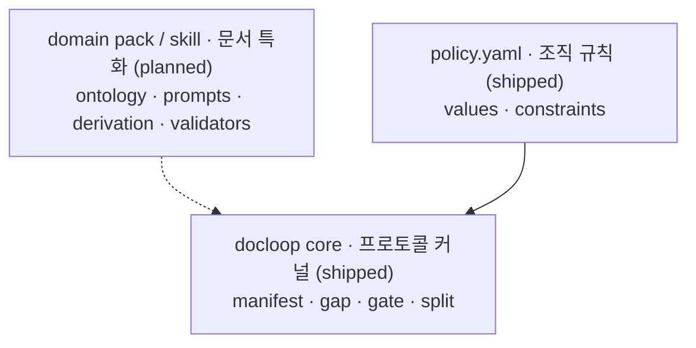

# docloop

**A thin writing harness for PM/spec documents** — it wraps a model CLI you already
use (`codex` or `claude -p`) into a disciplined loop for writing, auditing, and
cross-reviewing documents (PRDs, specs, policies).
**PM·기획 문서(PRD·정책서 등)를 위한 얇은 글쓰기 하네스** — 이미 사용 중인 모델 CLI(`codex`
또는 `claude -p`)를 감싸 문서를 작성·감사·교차 리뷰하는, 규율 있는 루프로 묶는다.

> **Writing has no single oracle** — docloop checks what can be checked (source-grounded
> accuracy, consistency, policy), surfaces the gaps, and stops; judgment stays with the human.
>
> **글에는 단일 오라클이 없다** — docloop은 검증 가능한 것(출처 대비 정확성·정합·정책)만 점검해
> 빈틈을 드러내고 멈춘다. 판단은 사람의 몫으로 남는다.

docloop adds **no new runtime and no new agent.** The value is in three things:
docloop은 **새 런타임도 새 에이전트도 만들지 않는다.** 가치는 세 가지에 있다:

1. **The prompts** (`prompts/`) — the pipeline: plan → draft → audit → review → gate → split
   (`audit` runs the gap-audit machinery).
   <br>**프롬프트** (`prompts/`) — 파이프라인: plan → draft → audit → review → gate → split
   (`audit`는 gap-audit 기계를 돌린다).
2. **The scripts** (`lib/`) — manifest validation, consistency reporting, release gates, publish split.
   <br>**스크립트** (`lib/`) — manifest 검증, 정합성 리포트, 릴리스 게이트, 배포용 분할.
3. **The loop discipline** — manifest-as-state, evidence-over-plausibility, and a human approval gate.
   <br>**루프 규율** — manifest=상태, 그럴듯함보다 근거, 사람 승인 게이트.

## Why a *writing* harness differs from a coding one · 왜 글쓰기 하네스는 코딩 하네스와 다른가

Coding harnesses work because code has an **oracle**: the compiler and the test suite
tell you, objectively, whether the loop converged. An agent can grind away because
something outside it can say "still wrong."
코딩 하네스가 동작하는 것은 코드에 **Oracle**(정답 판정자)이 있기 때문이다 — 컴파일러와
테스트가 루프의 수렴 여부를 객관적으로 알려준다. 에이전트 밖에서 "아직 틀렸다"고 말해 줄
무언가가 있기에 루프를 계속 돌릴 수 있다.

**Writing has no oracle.** There is no compiler for a PRD, so a naive
"write → self-check → rewrite" loop just converges on its own confident prose.
**글에는 Oracle이 없다.** PRD를 위한 컴파일러는 없으므로, 단순한 "작성 → 자가검토 → 재작성"
루프는 스스로 확신에 찬 문장으로 수렴할 뿐이다.

docloop's answer is to split the problem:
docloop의 해법은 문제를 둘로 쪼개는 것이다:

- **What *can* be made convergent** — source-grounded accuracy (agreement with selected
  sources), internal/cross-document consistency, policy compliance — is driven by loops
  with real checks: gap-audit (fan-out consistency), scripted release gates, and an
  **external model as independent pressure** (the review stage: Codex/Gemini/another Claude
  attacks the draft — an *attention* test, not a *truth* test, since a second model shares
  the first's blind spots). docloop detects drift from the selected sources; it does not
  prove those sources are true or current.
  <br>**수렴시킬 수 있는 것**(출처 대비 정확성=선택한 출처와의 일치, 문서 내·문서 간 정합, 정책 준수)은
  실제 점검이 있는 루프로 돌린다: gap-audit(팬아웃 정합 점검), 스크립트 릴리스 게이트, 그리고 **외부
  모델을 독립적 압력으로** 둔다(review 단계에서 Codex·Gemini·다른 Claude가 초안을 공격 — 두 번째 모델도
  첫 모델의 맹점을 상당 부분 공유하므로 진짜 Oracle은 아니고, 정답 판정이 아니라 주의환기 점검).
  docloop은 선택한 출처로부터의 드리프트를 잡을 뿐, 그 출처가 참이거나 최신임을 증명하지는 않는다.
- **What can't** — voice, judgment, the actual decisions — stays **outside the loop,
  with the human.** The harness surfaces gaps and stops; it never manufactures consensus.
  <br>**수렴시킬 수 없는 것**(문체, 판단, 실제 의사결정)은 **루프 밖, 사람의 몫**으로 둔다.
  하네스는 빈틈을 드러내고 멈출 뿐, 합의를 지어내지 않는다.

See [`docs/design.md`](docs/design.md) for the full argument.
전체 논의는 [`docs/design.md`](docs/design.md)에서 다룬다.

## Where docloop draws the line · docloop이 긋는 선

docloop owns only the shared protocol — manifest state, gap-audit, gate, split; org rules
live in `policy.yaml`; the core imports no document type. See [`docs/design.md`](docs/design.md)
for the full argument, and the **Direction (planned)** section below for where this is meant to go.

docloop은 공용 프로토콜만 소유한다 — manifest 상태, gap-audit, gate, split. 조직 규칙은 `policy.yaml`에
두고, core는 어떤 문서 타입도 import하지 않는다. 전체 논의는 [`docs/design.md`](docs/design.md),
지향점은 아래 **Direction(계획)** 섹션 참고.

## Install · 설치

```bash
git clone https://github.com/kaidomo/docloop && cd docloop
pip install -r requirements.txt       # PyYAML (used by the lib/ scripts)
chmod +x bin/docloop
export PATH="$PWD/bin:$PATH"          # or symlink bin/docloop onto your PATH
export DOCLOOP_MODEL=codex            # or: claude   (default: codex)
```

Requirements: Python 3 + PyYAML (`pip install -r requirements.txt`), and one of the
`codex` or `claude` CLIs on your PATH.
필요 사항: Python 3 + PyYAML, 그리고 `codex` 또는 `claude` CLI 중 하나가 PATH에 있어야 한다.

## Quick start · 빠른 시작

```bash
docloop init ~/work/case-submission ./submission-policy.md   # scaffold + isolate inputs
cd ~/work/case-submission
cp /path/to/docloop/templates/policy.example.yaml ./policy.yaml   # edit to your house style

docloop plan  "PRD for the case submission flow"   # interview -> manifest
docloop draft                                       # write grounded sections
docloop audit                                       # find contradictions, report
docloop review case-submission ./PRD_*.md           # attention test: external-model cross-review
docloop gate                                        # release gate (strict)
docloop split                                       # regenerate publish pages
```

## The variable layer: `policy.yaml` · 가변층: `policy.yaml`

Your org's section order, required sections, glossary, forbidden words, tone, and
Definition of Done live in **one file** (`policy.yaml`) — never in the engine. Swap
orgs, swap that one file. See `templates/policy.example.yaml`.
조직별 규칙(섹션 순서, 필수 섹션, 용어, 금칙어, 톤, Definition of Done)은 엔진이 아니라 **한 파일**
(`policy.yaml`)에 둔다. 조직이 바뀌면 이 파일 하나만 교체한다. `templates/policy.example.yaml` 참고.

## Direction (planned, not shipped) · 방향(계획·미구현)

This section is design direction, not a feature list. **Current:** the protocol-kernel
boundary and the `policy.yaml` variable layer — the shipped verb set is `init · plan ·
draft · audit · review · gate · split` plus the `atb-*` change-plan stages. **Planned,
not shipped:** a domain-pack loader, a derivation-manifest execution path, and the
reviewer-eval gold set. The conditional-tense text below describes where those planned pieces would go.

이 섹션은 기능 목록이 아니라 설계 방향이다. **현재 있는 것:** 프로토콜 커널 경계와 `policy.yaml`
가변층 — shipped verb는 `init · plan · draft · audit · review · gate · split` + `atb-*`
변경계획 스테이지다. **계획이며 미구현:** domain-pack 로더, derivation manifest 실행 경로,
reviewer-eval 골드셋. 아래 조건법 문장은 그 계획된 조각들이 어디로 갈지를 그린다.

The intended shape is a **shared protocol kernel** rather than the single canonical engine
behind a family of specialized authoring skills. In that target, document *meaning*
(ontology, prompts, derivations) *would* live in domain packs/skills; declarative org rules
already live in `policy.yaml`; the core *would* own only the protocol — the boundary test
being that **core imports no document type**.

지향하는 형태는 특화 스킬군의 유일한 정본 엔진이 아니라 **공용 프로토콜 커널**이다. 그 목표에서
문서의 *의미*(ontology·프롬프트·파생)는 domain pack/스킬에 두게 *될 것이고*, 선언형 조직 규칙은
이미 `policy.yaml`에 있으며, core는 프로토콜만 소유하게 *될 것이다* — 경계 판정은 **core가 어떤
문서 타입도 import하지 않는다**는 것이다.



Two directions *would* follow. **Derivation** (PRD → storyboard → manual) *would not* be a
core verb — a future domain pack *would* author a *derivation manifest* and the core's
intended role *would be* protocol execution only. And because the **review stage is an
oracle stand-in, it would need grading too**: reviewer quality is **not operational** today,
and the planned metric *would* evaluate it **offline against a veteran-PM gold set**
(blocking-recall, not text similarity) — the gold set does not yet exist.

두 방향이 뒤따르게 *될 것이다*. **파생**(PRD → 스토리보드 → 매뉴얼)은 core verb가 *아니게 될
것이고* — 향후 domain pack이 *derivation manifest*를 쓰고 core의 역할은 실행만으로 한정될 *것이다*.
그리고 **review 단계는 오라클 대용이라 그 자체도 채점 대상이 될 것**이다: 리뷰어 품질은 현재
**미가동(not operational)**이며, 향후 지표는 이를 **베테랑 PM 골드셋 대비 오프라인**(텍스트 유사도가
아니라 blocking-recall)으로 **측정할 계획**이다 — 골드셋은 아직 존재하지 않는다.

**Design & rationale · 설계와 근거**:
[`design.md`](docs/design.md) (protocol kernel · 프로토콜 커널) ·
[`reviewer-eval-bootstrap.md`](docs/reviewer-eval-bootstrap.md) (grading the reviewer · 리뷰어 채점) ·
[`reviewer-lens-set.md`](docs/reviewer-lens-set.md) (73 review lenses · 리뷰 렌즈 73) ·
[`cold-start-strategies.md`](docs/cold-start-strategies.md) (evidence acquisition · 증거 획득).

## Change-plan mode (as-is/to-be) · 변경계획 모드

A second, delineated pipeline for the other half of the job: not writing a fresh doc, but
**planning fixes to a system that already exists.** You read the product/docs/logs/code, then
produce a single **as-is/to-be** change plan for a human to apply by hand (not an agent handoff).
It reuses the same machinery (manifest, validate, gates, `init`, `review`) with its own stages.
기존에 없는 문서를 새로 쓰는 게 아니라, **이미 있는 시스템을 어떻게 고칠지** 계획하는 다른 절반.
제품·문서·로그·코드를 읽고, 사람이 손으로 고칠 **단일 as-is/to-be 변경계획서**를 낸다(자율 실행 핸드오프 아님).
manifest·검증·게이트·`init`·`review`는 공유하고, 스테이지만 별도다.

Why it's a mode, not a footnote: docloop's thesis is *separate the part with an oracle from the
part without.* Change-plan mode is a clean instance — **as-is has an oracle** (the code/screen/log
either says X or it doesn't; the ground-audit gate enforces it), **to-be doesn't** (it's judgment,
left to the human). See [`docs/design.md`](docs/design.md).

```bash
docloop init ~/work/fix-submission ./inputs/            # scaffold + isolate inputs
cd ~/work/fix-submission
cp /path/to/docloop/templates/policy.atb.example.yaml ./policy.atb.yaml   # sequencing + consumer + taxonomy

docloop atb-capture ./inputs/     # read the system -> capture observations (with evidence)
docloop atb-chunk                 # group into chunks + sequence (order + rationale)
docloop atb-author                # write the as-is/to-be body per chunk into the SSOT
docloop atb-audit                 # ground-audit: verify each as-is against its evidence (fan-out)
docloop atb-gate                  # handoff gate (ground_audit.py --strict)
```

Stages: `atb-capture` (observations=issues) → `atb-chunk` (chunks=handoff, with ordering) →
`atb-author` (single as-is/to-be doc) → `atb-audit` / `atb-gate` (ground-audit: an as-is with no
source is blocked — *a to-be built on a wrong as-is is the most expensive mistake*). The
`blast_radius` direction (default `high_risk_first`) and the ATB **handoff consumer**
(`consumer`, default `human` — the recipient the plan is written up for; distinct from the
`authoring`/`evaluator` consumer *role* in [`docs/design.md`](docs/design.md)) live in
`templates/policy.atb.example.yaml`.

## Role-panel review & prediction lock · 역할 패널 리뷰와 예측 봉인

Two pieces ported (downstream) from the canonical skill repo — same thesis, new instruments.
정본 스킬 저장소에서 다운스트림으로 포팅한 두 조각 — 같은 테제, 새 도구.

**`docloop panel`** — one artifact, several *independent* job-role evaluators (PM · Product Designer ·
Frontend · Backend · QA, or case-specific roles). A role is a **failure-surface contract**
(questions · evidence access · abstain conditions), not a job-title persona. Each role runs as its
**own headless model process**, and role outputs are held outside the review folder until every
role finishes (the prompt additionally forbids reading PANEL_* files) — process separation on one
machine, not an air gap. An
Area Chair synthesis then preserves conflicts and lone criticals, never averages or majority-votes,
marks same-model agreement as *correlated* (recorded, no confidence boost), and hands the human
**at most 5 decision items** (role outputs stay as the appendix).
**`docloop panel`** — 한 산출물을 여러 **독립** 직무 평가자(PM·디자이너·FE·BE·QA 또는 케이스 특화
역할)가 검토한다. 역할은 직함 페르소나가 아니라 **실패면 계약**(질문·증거 접근·abstain 조건)이다.
역할마다 **별도 헤드리스 프로세스**로 돌고, 역할 출력은 전원이 끝날 때까지 리뷰 폴더 밖에 보관된다
(프롬프트도 PANEL_* 파일 열람을 금지) — 같은 머신 안의 프로세스 분리이지 물리적 차단은 아니다.
Area Chair 합성은 충돌·단독
critical을 보존하며 평균·다수결을 쓰지 않고, 같은 모델끼리의 합의는 correlated로 기록만 한다(확신도
불상승). 사람 앞에는 **결정 항목 5건 이하**만 놓인다(역할 원본은 부록).

**`docloop lock` / `docloop verify`** — make "I knew it" falsifiable. Hash a prediction file *before*
the outcome exists (digest goes in a **sidecar**, outside the hashed file), re-hash at reveal; a
mismatch means *judge nothing* (diagnostic-only). For third-party verifiability, commit
payload+sidecar before the reveal. Only this primitive is ported — the full learning lifecycle
stays upstream, and judgment stays with the human.
**`docloop lock` / `docloop verify`** — "그럴 줄 알았다"를 반증 가능하게 만든다. 결과가 존재하기
*전에* 예측 파일을 해시로 봉인하고(digest는 해시 대상 밖 **sidecar**에), 공개 시점에 재해시한다.
불일치면 *판정하지 않는다*(diagnostic-only). 제3자 검증이 필요하면 공개 전에 payload+sidecar를
커밋해 둔다. 포팅된 것은 이 프리미티브뿐 — 학습 lifecycle 전체는 정본(스킬) 쪽에 있고, 판단은
사람의 몫이다.

```bash
docloop review case-x ./PRD_*.md                    # stage + brief (reused)
docloop lock  ~/notes/b1-prediction.md              # optional: seal what you expect the panel to find
docloop panel ~/.docloop/reviews/case-x 1           # 5 default roles, per-process isolation
docloop panel ~/.docloop/reviews/case-x 2 pm qa pv-practitioner   # custom role set (contract in the brief)
docloop verify ~/notes/b1-prediction.md ~/notes/b1-prediction.md.lock.yaml   # reveal: intact? then compare
```

## Layout · 구성

```
bin/docloop          thin launcher (wraps codex / claude -p)
prompts/             stage prompts — doc mode: plan/draft/gap-audit/review · change-plan mode: atb-capture/atb-chunk/atb-author/atb-audit
lib/                 python scripts: init, validate, gap_audit, ground_audit, split, approval_brief, stage, ...
templates/           policy + manifest skeletons (doc + .atb change-plan variants), review-brief template
docs/design.md       why writing harnesses differ from coding harnesses; design decisions (protocol kernel, reviewer-eval)
docs/reviewer-eval-bootstrap.md   bootstrapping a reviewer-quality gold set from review residue · 리뷰 잔여물에서 리뷰어 골드셋 부트스트랩
docs/reviewer-lens-set.md         document-review lenses harvested from PM skills (55 → 73 criteria) · PM 스킬에서 하베스트한 문서 리뷰 렌즈
docs/cold-start-strategies.md     initial evidence-acquisition patterns for authoring · 저작 초기 증거 획득 패턴
```

## License · 라이선스

MIT — see [LICENSE](LICENSE).
