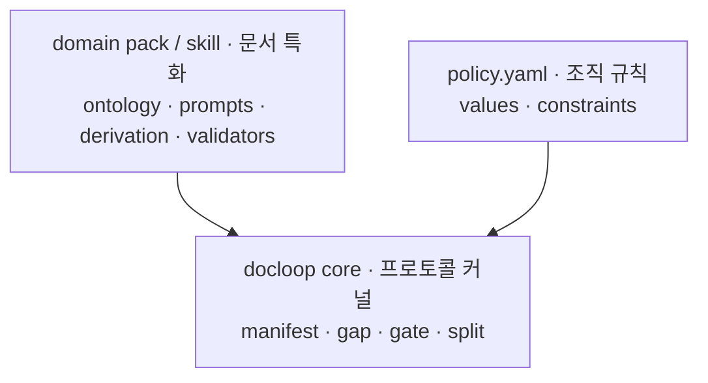

# docloop

**A thin writing harness for PM/spec documents** — it wraps a model CLI you already
use (`codex` or `claude -p`) into a disciplined loop for writing, auditing, and
cross-reviewing documents (PRDs, specs, policies).
**PM·기획 문서(PRD·정책서 등)를 위한 얇은 글쓰기 하네스** — 이미 사용 중인 모델 CLI(`codex`
또는 `claude -p`)를 감싸 문서를 작성·감사·교차 리뷰하는, 규율 있는 루프로 묶는다.

docloop adds **no new runtime and no new agent.** The value is in three things:
docloop은 **새 런타임도 새 에이전트도 만들지 않는다.** 가치는 세 가지에 있다:

1. **The prompts** (`prompts/`) — a five-stage pipeline: plan → draft → gap-audit → review → split.
   <br>**프롬프트** (`prompts/`) — 5단계 파이프라인: plan → draft → gap-audit → review → split.
2. **The scripts** (`lib/`) — manifest validation, consistency reporting, release gates, publish split.
   <br>**스크립트** (`lib/`) — manifest 검증, 정합성 리포트, 릴리스 게이트, 배포용 분할.
3. **The loop discipline** — manifest-as-state, evidence-over-plausibility, and a human approval gate.
   <br>**루프 규율** — manifest=상태, 그럴듯함보다 근거, 사람 승인 게이트.

## Why a *writing* harness differs from a coding one · 왜 글쓰기 하네스는 코딩 하네스와 다른가

Coding harnesses work because code has an **oracle**: the compiler and the test suite
tell you, objectively, whether the loop converged. An agent can grind away because
something outside it can say "still wrong."
코딩 하네스가 동작하는 것은 코드에 **Oracle**(정답 판정자)이 있기 때문이다 — 컴파일러와
테스트가 루프의 수렴 여부를 객관적으로 알려준다. 에이전트 밖에서 "아직 틀렸다"고 말해 줄
무언가가 있기에 루프를 계속 돌릴 수 있다.

**Writing has no oracle.** There is no compiler for a PRD, so a naive
"write → self-check → rewrite" loop just converges on its own confident prose.
**글에는 Oracle이 없다.** PRD를 위한 컴파일러는 없으므로, 단순한 "작성 → 자가검토 → 재작성"
루프는 스스로 확신에 찬 문장으로 수렴할 뿐이다.

docloop's answer is to split the problem:
docloop의 해법은 문제를 둘로 쪼개는 것이다:

- **What *can* be made convergent** — factual accuracy, internal/cross-document
  consistency, policy compliance — is driven by loops with real checks: gap-audit
  (fan-out consistency), scripted release gates, and an **external model as
  independent pressure** (the review stage: Codex/Gemini/another Claude attacks the
  draft — an *attention* test, not a *truth* test, since a second model shares the
  first's blind spots).
  <br>**수렴시킬 수 있는 것**(사실 정확성, 문서 내·문서 간 정합, 정책 준수)은 실제 점검이 있는
  루프로 돌린다: gap-audit(팬아웃 정합 점검), 스크립트 릴리스 게이트, 그리고 **외부 모델을 독립적
  압력으로** 둔다(review 단계에서 Codex·Gemini·다른 Claude가 초안을 공격 — 두 번째 모델도 첫 모델의
  맹점을 상당 부분 공유하므로 진짜 Oracle은 아니고, 정답 판정이 아니라 주의환기 점검).
- **What can't** — voice, judgment, the actual decisions — stays **outside the loop,
  with the human.** The harness surfaces gaps and stops; it never manufactures consensus.
  <br>**수렴시킬 수 없는 것**(문체, 판단, 실제 의사결정)은 **루프 밖, 사람의 몫**으로 둔다.
  하네스는 빈틈을 드러내고 멈출 뿐, 합의를 지어내지 않는다.

See [`docs/design.md`](docs/design.md) for the full argument.
전체 논의는 [`docs/design.md`](docs/design.md)에서 다룬다.

## Install · 설치

```bash
git clone https://github.com/kaidomo/docloop && cd docloop
pip install -r requirements.txt       # PyYAML (used by the lib/ scripts)
chmod +x bin/docloop
export PATH="$PWD/bin:$PATH"          # or symlink bin/docloop onto your PATH
export DOCLOOP_MODEL=codex            # or: claude   (default: codex)
```

Requirements: Python 3 + PyYAML (`pip install -r requirements.txt`), and one of the
`codex` or `claude` CLIs on your PATH.
필요 사항: Python 3 + PyYAML, 그리고 `codex` 또는 `claude` CLI 중 하나가 PATH에 있어야 한다.

## Quick start · 빠른 시작

```bash
docloop init ~/work/case-submission ./submission-policy.md   # scaffold + isolate inputs
cd ~/work/case-submission
cp /path/to/docloop/templates/policy.example.yaml ./policy.yaml   # edit to your house style

docloop plan  "PRD for the case submission flow"   # interview -> manifest
docloop draft                                       # write grounded sections
docloop audit                                       # find contradictions, report
docloop review case-submission ./PRD_*.md           # Oracle: external-model cross-review
docloop gate                                        # release gate (strict)
docloop split                                       # regenerate publish pages
```

## The variable layer: `policy.yaml` · 가변층: `policy.yaml`

Your org's section order, required sections, glossary, forbidden words, tone, and
Definition of Done live in **one file** (`policy.yaml`) — never in the engine. Swap
orgs, swap that one file. See `templates/policy.example.yaml`.
조직별 규칙(섹션 순서, 필수 섹션, 용어, 금칙어, 톤, Definition of Done)은 엔진이 아니라 **한 파일**
(`policy.yaml`)에 둔다. 조직이 바뀌면 이 파일 하나만 교체한다. `templates/policy.example.yaml` 참고.

## Change-plan mode (as-is/to-be) · 변경계획 모드

A second, delineated pipeline for the other half of the job: not writing a fresh doc, but
**planning fixes to a system that already exists.** You read the product/docs/logs/code, then
produce a single **as-is/to-be** change plan for a human to apply by hand (not an agent handoff).
It reuses the same machinery (manifest, validate, gates, `init`, `review`) with its own stages.
기존에 없는 문서를 새로 쓰는 게 아니라, **이미 있는 시스템을 어떻게 고칠지** 계획하는 다른 절반.
제품·문서·로그·코드를 읽고, 사람이 손으로 고칠 **단일 as-is/to-be 정본**을 낸다(자율 실행 핸드오프 아님).
manifest·검증·게이트·`init`·`review`는 공유하고, 스테이지만 별도다.

Why it's a mode, not a footnote: docloop's thesis is *separate the part with an oracle from the
part without.* Change-plan mode is a clean instance — **as-is has an oracle** (the code/screen/log
either says X or it doesn't; the ground-audit gate enforces it), **to-be doesn't** (it's judgment,
left to the human). See [`docs/design.md`](docs/design.md).

```bash
docloop init ~/work/fix-submission ./inputs/            # scaffold + isolate inputs
cd ~/work/fix-submission
cp /path/to/docloop/templates/policy.atb.example.yaml ./policy.atb.yaml   # sequencing + consumer + taxonomy

docloop atb-capture ./inputs/     # read the system -> capture observations (with evidence)
docloop atb-chunk                 # group into chunks + sequence (order + rationale)
docloop atb-author                # write the as-is/to-be body per chunk into the SSOT
docloop atb-audit                 # ground-audit: verify each as-is against its evidence (fan-out)
docloop atb-gate                  # handoff gate (ground_audit.py --strict)
```

Stages: `atb-capture` (observations=issues) → `atb-chunk` (chunks=handoff, with ordering) →
`atb-author` (single as-is/to-be doc) → `atb-audit` / `atb-gate` (ground-audit: an as-is with no
source is blocked — *a to-be built on a wrong as-is is the most expensive mistake*). The
`blast_radius` direction (default `high_risk_first`) and `consumer` (default `human`, one flag from
`agent`-ready) live in `templates/policy.atb.example.yaml`.

## Design direction: a protocol kernel · 설계 방향: 프로토콜 커널

docloop deliberately stays a **shared validation/execution protocol kernel** rather
than the single canonical engine behind a family of specialized authoring skills.
Document *meaning* (ontology, prompts, derivations) lives in domain packs/skills;
declarative org rules live in `policy.yaml`; the core owns only the protocol. Ownership
is layered so each rule lives in exactly one place — the boundary test: **core imports
no document type.**

docloop은 특화 스킬군의 유일한 정본 엔진이 아니라 **공용 검증·실행 프로토콜 커널**로 남는다.
문서의 *의미*(ontology·프롬프트·파생)는 domain pack/스킬에, 선언형 조직 규칙은 `policy.yaml`에,
core는 프로토콜만 소유한다. 각 규칙이 정확히 한 곳에만 있도록 계층화한다 — 경계 판정: **core는
어떤 문서 타입도 import하지 않는다.**



Two related decisions: **derivation** (PRD → storyboard → manual) is not a core verb —
a domain pack authors a *derivation manifest* and the core only executes it; and a
reviewer needs an oracle too, so reviewer quality is graded **offline against a
veteran-PM gold set** (blocking-recall, not text similarity) — a target decided but
**not yet operational** (it needs the gold set).

관련 결정 둘: **파생**(PRD → 스토리보드 → 매뉴얼)은 core verb가 아니다 — domain pack이
*derivation manifest*를 쓰고 core는 실행만 한다. 그리고 리뷰어에게도 Oracle이 필요하므로,
리뷰어 품질은 **베테랑 PM 골드셋 대비 오프라인 채점**(텍스트 유사도가 아니라 blocking-recall)으로
잰다 — 목표는 정해졌으나 **아직 미가동**(골드셋 필요).

See [`docs/design.md`](docs/design.md) ·
[`docs/reviewer-eval-bootstrap.md`](docs/reviewer-eval-bootstrap.md) ·
[`docs/reviewer-lens-set.md`](docs/reviewer-lens-set.md) ·
[`docs/cold-start-strategies.md`](docs/cold-start-strategies.md).

## Layout · 구성

```
bin/docloop          thin launcher (wraps codex / claude -p)
prompts/             stage prompts — doc mode: plan/draft/gap-audit/review · change-plan mode: atb-capture/atb-chunk/atb-author/atb-audit
lib/                 python scripts: init, validate, gap_audit, ground_audit, split, approval_brief, stage, ...
templates/           policy + manifest skeletons (doc + .atb change-plan variants), review-brief template
docs/design.md       why writing harnesses differ from coding harnesses; design decisions (protocol kernel, reviewer-eval)
docs/reviewer-eval-bootstrap.md   bootstrapping a reviewer-quality gold set from review residue · 리뷰 잔여물에서 리뷰어 골드셋 부트스트랩
docs/reviewer-lens-set.md         document-review lenses harvested from PM skills (55 → 73 criteria) · PM 스킬에서 하베스트한 문서 리뷰 렌즈
docs/cold-start-strategies.md     initial evidence-acquisition patterns for authoring · 저작 초기 증거 획득 패턴
```

## License · 라이선스

MIT — see [LICENSE](LICENSE).
