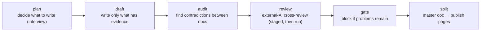

# docloop

한국어: [README.ko.md](README.ko.md)

**Write your planning docs, and docloop catches what's off — before your reviewer does.**
Draft a PRD, a policy, or a change plan, then run docloop in your terminal — it drives the
AI CLI you already use (`codex` or `claude -p`) for you, and nothing is applied to the
document unless you approve it.

> Under the hood, docloop checks only what can be checked, surfaces the gaps, and stops —
> judgment stays with the human. That approach has a name: a verification-first document
> kernel. Why: [`docs/design.md`](docs/design.md).

## What you can do

- **See where your PRD, storyboard, and manual disagree** — `audit` compares your documents and reports the contradictions.
- **Check that every "as-is" claim in a change plan has real evidence** — an unsourced claim is blocked before the plan is handed off (change-plan mode).
- **Catch quotes that no longer match the original** — a separate companion check compares each quote against its source (spacing differences ignored).
- **Let an external AI attack your draft — and apply only what you approve** — every finding gets an ID and a keep/drop decision.
- **Cut the master document into pages for Confluence and the like** — `split` cuts the pages from the one master copy; regenerate the deliverables anytime.

## Get started

### Install

```bash
git clone https://github.com/kaidomo/docloop && cd docloop
pip install -r requirements.txt       # the one library the checks need (PyYAML)
chmod +x bin/docloop
export PATH="$PWD/bin:$PATH"          # use docloop in this terminal session (add this line to your shell profile to keep it)
export DOCLOOP_MODEL=codex            # which AI CLI docloop should drive: codex or claude
```

Requirements: Python 3 + PyYAML, and one of the `codex` or `claude` CLIs on your PATH.

### Quick start

```bash
docloop init ~/work/case-submission ./submission-policy.md   # make a work folder (the input files you pass are MOVED into its inputs/)
cd ~/work/case-submission
cp /path/to/docloop/templates/policy.example.yaml ./policy.yaml   # your org's document rules live in this one file — edit to fit

docloop plan  "PRD for the case submission flow"   # short interview: agree on what to write
docloop draft                                       # write, using only what the sources support
docloop audit                                       # find contradictions between documents
docloop review case-submission ./PRD_*.md           # set up the external-AI cross-review (it guides the attack run as the next step)
docloop gate                                        # final check: unresolved problems block it
docloop split                                       # cut the master doc into publish pages
```



## Limitations

- An AI model does the finding — treat `audit`, `review`, and `panel` reports as a sharp-eyed assistant, not a verdict.
- docloop checks your document against the sources you chose; it does not prove those sources true.
- The checks-then-`split` order is a workflow, not enforced by the tool — the final call is always yours.

## Learn more

- [`docs/change-plan-mode.md`](docs/change-plan-mode.md) — the as-is/to-be pipeline (`atb-*`) for planning fixes to a system that already exists.
- [`docs/panel-and-lock.md`](docs/panel-and-lock.md) — role-panel review (`panel`) and sealed predictions (`lock` / `verify`).
- [`docs/policy-layer.md`](docs/policy-layer.md) — the one file (`policy.yaml`) that holds your org's document rules.
- [`docs/direction.md`](docs/direction.md) — what's inside today, and what is planned but not shipped.
- [`docs/design.md`](docs/design.md) — why documents need a verification kernel, and where docloop draws the line.

## License

MIT — see [LICENSE](LICENSE).
