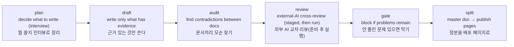

# docloop

**Write your planning docs, and docloop catches what's off — before your reviewer does.**
Draft a PRD, a policy, or a change plan, then run docloop in your terminal — it drives
the AI CLI you already use (`codex` or `claude -p`) for you. It reports contradictions
between your documents, flags change-plan claims that have no evidence behind them, and
a companion check catches quotes that drifted from the original. Nothing is applied to
the document unless you approve it.
**기획 문서를 쓰면, 리뷰어보다 먼저 docloop이 어긋난 곳을 잡아준다.** PRD·정책서·변경계획을
쓰고 나서 터미널에서 docloop을 돌리면 — 이미 쓰는 AI CLI(`codex` 또는 `claude -p`)는 docloop이
대신 구동한다 — 문서끼리 모순을 보고하고, 변경계획의 근거 없는 주장을 표시하며, 동반 검사가
원본과 달라진 인용을 잡는다. 반영은 당신이 승인한 것만 한다.

> Under the hood: **a verification-first document kernel**. Writing has no single oracle
> (an automatic judge of "correct", the way a compiler judges code), so docloop checks only
> what can be checked, surfaces the gaps, and stops — judgment stays with the human.
> 속은 **검증 우선 문서 커널**이다. 글에는 단일 오라클(코드의 컴파일러처럼 "맞다"를 판정해
> 주는 자동 심판)이 없으므로, 검증 가능한 것만 점검해 빈틈을 드러내고 멈춘다 — 판단은
> 사람의 몫이다.

## What you can do · 뭘 할 수 있나

- **See where your PRD, storyboard, and manual disagree** — `audit` compares your
  documents and reports the contradictions. An AI model does the reading, so treat the
  report as a sharp-eyed assistant, not a verdict.
  <br>**PRD·스토리보드·매뉴얼이 서로 어긋난 곳을 리포트로 받는다** — `audit`가 문서들을
  대조해 모순을 보고한다. AI가 읽어서 찾는 것이므로, 판정이 아니라 검토 보조로 쓴다.
- **Check that every "as-is" claim in a change plan has real evidence** — a claim with
  no source behind it is blocked before the plan is handed off (change-plan mode).
  <br>**변경계획의 as-is 주장마다 근거가 실제로 있는지 확인한다** — 출처 없는 주장은
  계획을 넘기기 전에 걸린다(변경계획 모드).
- **Catch quotes that no longer match the original** — a separate check compares each
  quote against its source (spacing differences ignored) and flags the ones that
  drifted; run it alongside the gate.
  <br>**인용이 원본과 달라지면 잡는다** — 별도 검사가 인용을 출처와 대조해(띄어쓰기 차이는
  무시) 어긋난 것을 표시한다. 게이트와 나란히, 함께 돌려 쓰는 별도 검사다.
- **Let an external AI attack your draft — and apply only what you approve** — every
  finding gets an ID and a keep/drop decision, and nothing lands in the document
  without your sign-off.
  <br>**외부 AI가 초안을 공격하게 하고, 반영은 당신이 승인한 것만** — 지적마다 번호가 붙고
  반영/기각을 정하며, 승인 없이는 문서에 들어가지 않는다.
- **Get the draft reviewed from several job perspectives at once** — PM · designer ·
  frontend · backend · QA by default (custom roles work too), each reviewing
  independently; a chair role sums them up with no averaging and no majority vote, so a
  lone critical objection survives. The roles are AI passes, not human experts — treat
  them as prepared perspectives; the decision stays with you.
  <br>**여러 직무의 눈으로 한 번에 검토받는다** — 기본 PM·디자이너·FE·BE·QA(커스텀 역할
  가능)가 각자 독립적으로 보고, 의장 역할이 종합한다(평균·다수결 없음) — 혼자 나온 치명적
  지적도 살아남는다. 역할들도 결국 AI가 관점을 나눠 본 것이지 사람 전문가가 아니다 —
  준비된 관점으로 쓰고, 결정은 당신 몫이다.
- **Keep "I knew it" honest** — seal a prediction before the result exists (`lock`),
  and check it was untouched when you open it (`verify`). A record for yourself — it
  judges nothing on its own.
  <br>**"그럴 줄 알았다"를 기록으로 남긴다** — 결과가 나오기 전에 예측을 봉인하고(`lock`),
  열어볼 때 그대로였는지 확인한다(`verify`). 스스로를 위한 기록이지, 그 자체로 판정하지
  않는다.
- **Cut the master document into pages for Confluence and the like** — the intended
  order is checks first (`gate`), then `split` cuts the pages from the one master copy
  (the order is a workflow, not enforced by the tool); regenerate the deliverables anytime.
  <br>**정본 문서를 컨플루언스 등에 올릴 페이지로 쪼갠다** — 의도된 순서는 먼저 `gate`로
  검사, 그다음 `split`이 하나뿐인 정본에서 페이지를 잘라내는 것(도구가 강제하지는 않는다) —
  정본은 하나, 배포본은 언제든 재생성.

## Get started · 시작하기

### Install · 설치

```bash
git clone https://github.com/kaidomo/docloop && cd docloop
pip install -r requirements.txt       # the one library the checks need (PyYAML)
chmod +x bin/docloop
export PATH="$PWD/bin:$PATH"          # use docloop in this terminal session (add this line to your shell profile to keep it)
export DOCLOOP_MODEL=codex            # which AI CLI docloop should drive: codex or claude
```

Requirements: Python 3 + PyYAML (`pip install -r requirements.txt`), and one of the
`codex` or `claude` CLIs on your PATH.
필요 사항: Python 3 + PyYAML, 그리고 `codex` 또는 `claude` CLI 중 하나가 PATH에 있어야 한다.

### Quick start · 빠른 시작

```bash
docloop init ~/work/case-submission ./submission-policy.md   # make a work folder (the input files you pass are MOVED into its inputs/)
cd ~/work/case-submission
cp /path/to/docloop/templates/policy.example.yaml ./policy.yaml   # your org's document rules — edit to fit

docloop plan  "PRD for the case submission flow"   # short interview: agree on what to write
docloop draft                                       # write, using only what the sources support
docloop audit                                       # find contradictions between documents
docloop review case-submission ./PRD_*.md           # set up the external-AI cross-review (it guides the attack run as the next step)
docloop gate                                        # final check: unresolved problems block it
docloop split                                       # cut the master doc into publish pages
```



## Why documents need a verification kernel (not just a writing loop) · 왜 문서에는 (글쓰기 루프가 아니라) 검증 커널이 필요한가

Coding loops converge because code has an **oracle** — the compiler and the tests say,
objectively, "still wrong." Writing has none: there is no compiler for a PRD, so a naive
"write → self-check → rewrite" loop just converges on its own confident prose. docloop's
core is a verification kernel because it splits the problem: what *can* be checked
(source-grounded accuracy, consistency, policy) runs in loops with real checks plus an
external model as independent pressure — an *attention* test, not a *truth* test — while
voice, judgment, and the actual decisions stay outside the loop, with the human. The
kernel detects drift from the sources you selected and stops; it does not prove those
sources true, and it never manufactures consensus.
코딩 루프가 수렴하는 것은 코드에 **오라클**이 있기 때문이다 — 컴파일러와 테스트가 "아직
틀렸다"를 객관적으로 말해 준다. 글에는 그것이 없다. PRD를 위한 컴파일러는 없으므로, 단순한
"작성 → 자가검토 → 재작성" 루프는 스스로 확신에 찬 문장으로 수렴할 뿐이다. docloop의 core가
검증 커널인 이유는 문제를 쪼개기 때문이다: 검증 *가능한* 것(출처 대비 정확성·정합·정책)은
실제 점검과 외부 모델의 독립적 압력(정답 판정이 아니라 주의환기 점검)이 있는 루프로 돌리고,
문체·판단·실제 의사결정은 루프 밖 사람의 몫으로 남긴다. 커널은 선택한 출처로부터의
드리프트를 잡고 멈출 뿐, 출처가 참임을 증명하지도 않고 합의를 지어내지도 않는다.

See [`docs/design.md`](docs/design.md) for the full argument.
전체 논의는 [`docs/design.md`](docs/design.md)에서 다룬다.

## Where docloop draws the line · docloop이 긋는 선

docloop owns only the shared validation/execution protocol kernel — manifest state, gap-audit,
gate, split; org rules live in `policy.yaml`; the core imports no document type. See
[`docs/design.md`](docs/design.md) for the full argument, and the **Direction (planned)**
section below for the pieces that remain planned.

docloop은 공용 검증/실행 프로토콜 커널만 소유한다 — manifest 상태, gap-audit, gate, split. 조직
규칙은 `policy.yaml`에 두고, core는 어떤 문서 타입도 import하지 않는다. 전체 논의는
[`docs/design.md`](docs/design.md), 아직 계획 단계인 조각들은 아래 **Direction(계획)** 섹션 참고.

## License · 라이선스

MIT — see [LICENSE](LICENSE).
