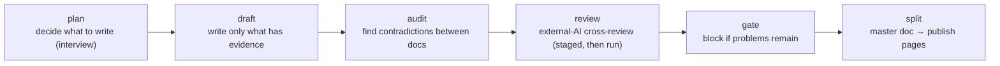

# docloop

한국어: [README.ko.md](README.ko.md)

**Write your planning docs, and docloop catches what's off — before your reviewer does.**
Draft a PRD, a policy, or a change plan, then run docloop in your terminal — it drives the
AI CLI you already use (`codex` or `claude -p`) for you, and nothing is applied to the
document unless you approve it.

> Under the hood, docloop checks only what can be checked, surfaces the gaps, and stops —
> judgment stays with the human. That approach has a name: a verification-first document
> kernel. Why: [`docs/design.md`](docs/design.md).

## What you can do

- **See where your PRD, storyboard, and manual disagree** — `audit` compares your documents and reports the contradictions.
- **Check that every "as-is" claim in a change plan has real evidence** — an unsourced claim is blocked before the plan is handed off (change-plan mode).
- **Catch quotes that no longer match the original** — a separate companion check compares each quote against its source (spacing differences ignored).
- **Let an external AI attack your draft — and apply only what you approve** — every finding gets an ID and a keep/drop decision.
- **Optionally collect named job perspectives before drafting** — `contribute` records separate, traceable suggestions; a person supplies decisions and materials before `curate` turns them into verified optional draft input.
- **Cut the master document into pages for Confluence and the like** — `split` cuts the pages from the one master copy; regenerate the deliverables anytime.

## Get started

### Install

```bash
git clone https://github.com/kaidomo/docloop && cd docloop
pip install -r requirements.txt       # the one library the checks need (PyYAML)
chmod +x bin/docloop
export PATH="$PWD/bin:$PATH"          # use docloop in this terminal session (add this line to your shell profile to keep it)
export DOCLOOP_MODEL=codex            # which AI CLI docloop should drive: codex or claude
```

Requirements: Python 3 + PyYAML, and one of the `codex` or `claude` CLIs on your PATH.
The optional `contribute` command uses Claude Code's `--safe-mode` and
`--json-schema` options when `DOCLOOP_MODEL=claude`; use a Claude Code release that
provides both flags (verified with 2.1.220). Plain `plan` and `draft` keep their
existing Claude invocation. The new `draft-curated` command grants Claude only
`Read`, `Glob`, `Grep`, `Edit`, and `Write` tools in non-interactive
`acceptEdits` mode; shell execution is not enabled by that command.

### Quick start

```bash
docloop init ~/work/case-submission ./submission-policy.md   # make a work folder (the input files you pass are MOVED into its inputs/)
cd ~/work/case-submission
cp /path/to/docloop/templates/policy.example.yaml ./policy.yaml   # your org's document rules live in this one file — edit to fit

docloop plan  "PRD for the case submission flow"   # short interview: agree on what to write
docloop draft                                       # write, using only what the sources support
docloop audit                                       # find contradictions between documents
docloop review case-submission ./PRD_*.md           # set up the external-AI cross-review (it guides the attack run as the next step)
docloop gate                                        # final check: unresolved problems block it
docloop split                                       # cut the master doc into publish pages
```


```mermaid
flowchart LR
  P["plan<br/>decide what to write (interview)"] --> D["draft<br/>write only what has evidence"]
  D --> A["audit<br/>find contradictions between docs"]
  A --> R["review<br/>external-AI cross-review (staged, then run)"]
  R --> G["gate<br/>block if problems remain"]
  G --> S["split<br/>master doc → publish pages"]
```

### Optional: contribute before drafting

The normal `plan → draft` path above is unchanged. If you explicitly want several
named perspectives first, add this separate branch:

```bash
docloop contribute cc-20260803-01 pm qa backend
cp work/contributions/cc-20260803-01/payload/human-response.template.yaml \
  work/contribution-responses/cc-20260803-01.yaml
# Edit the copy: record every disposition, add materials under inputs/, and attest it.
docloop curate cc-20260803-01 cur-20260803-01 \
  work/contribution-responses/cc-20260803-01.yaml
docloop draft-curated cur-20260803-01
```

This is opt-in at every step: `contribute` and `curate` never call the next stage,
and plain `docloop draft` never discovers a bundle. The perspective calls use the
same captured input bytes and write separate artifacts, but they are not isolated
or independent agents and do not guarantee expertise, correctness, completeness,
or consensus. Bundles retain copies of inputs, model output, human decisions, and
supplemental materials; your configured provider can receive source contents.
Codex contribution calls request its read-only sandbox and curated drafting requests
workspace-write; these provider settings are not an isolation guarantee.
See [the contribution and curation guide](docs/contribute-curate.md) for the response
schema, accepted-state checks, limits, privacy, concurrency, and manual retention.

## Limitations

- An AI model does the finding — treat `audit`, `review`, and `panel` reports as a sharp-eyed assistant, not a verdict.
- docloop checks your document against the sources you chose; it does not prove those sources true.
- Contribution attestation is self-attestation; it does not authenticate identity, authorship, or authority.
- The checks-then-`split` order is a workflow, not enforced by the tool — the final call is always yours.

## Learn more

- [`docs/change-plan-mode.md`](docs/change-plan-mode.md) — the as-is/to-be pipeline (`atb-*`) for planning fixes to a system that already exists.
- [`docs/panel-and-lock.md`](docs/panel-and-lock.md) — get the draft read from several job angles at once (`panel`), and pin down a prediction before the result exists (`lock` / `verify`).
- [`docs/contribute-curate.md`](docs/contribute-curate.md) — optionally collect perspectives, add human decisions and materials, and pass validated curated notes to drafting.
- [`docs/policy-layer.md`](docs/policy-layer.md) — the one file (`policy.yaml`) that holds your org's document rules.
- [`docs/direction.md`](docs/direction.md) — what's inside today, and what is planned but not shipped.
- [`docs/design.md`](docs/design.md) — why documents need a verification kernel, and where docloop draws the line.

## License

MIT — see [LICENSE](LICENSE).
