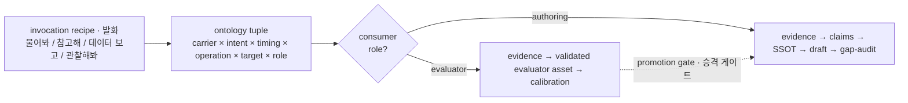

# 문서 저작 초기 증거 획득·재료화 패턴

문서 저작에서 백지 상태(=admissible SSOT claim이 0개인 *상태*)일 때 첫 재료를 얻는 방식을 두 층으로 본다. 이건 *분류*가 아니라 **해석 프레임**이다.

## 층 1 — 인보케이션 레시피 (사용자가 실제로 말하는 것)
사용자는 발화로 시작한다. 실전 진입 패턴과 그 operation 매핑:
- **"물어봐줘"** → operation: `elicit`
- **"이거 참고해서 초안 써줘"** → `retrieve` (+ 필요시 `normalize`)
- **"이 데이터 보고 개선할 거 뽑아서 기획해줘"** → `observe-measure` 또는 `retrieve`(데이터 성격에 따라) → `synthesize-or-mine` → `derive`
- **"이거 관찰·측정해봐"** → `observe-measure`

레시피는 **MECE가 아니다** — 같은 "이 데이터 보고"도 데이터 성격(신선한 계측/기존 리포트/의도 안 된 로그)에 따라 축이 갈린다. 실무는 여러 레시피를 **동시에** 쓴다. 그래서 레시피는 유용한 **프리셋**이지 배타 분류가 아니다.

## 층 2 — 온톨로지 (레시피를 무엇으로 해석하나)
각 레시피는 아래 축들의 조합(tuple)으로 파싱된다.

**증거 원천 (단일 origin이 아니라 3개 하위축)**
- **carrier(매개)**: human / artifact(문서) / system / world
- **production-intent(생성 의도 — 현재 증거 필요 기준)**: purpose-built(현재 필요에 맞춰 생성) / residual(잔여). 같은 triage 메모가 "triage 기록용으론 purpose-built, 이후 저작용으론 residual"일 수 있으므로 항상 *현재 에피소드* 기준으로 판정.
- **acquisition-timing(획득 시점 — 현재 획득 에피소드 내 불변)**: existing(기존) / newly-generated(신규). 신규 증거는 기록됐다고 곧장 existing이 되는 게 아니라, *다음* 획득 에피소드에 대해서만 existing이 된다(현재 에피소드 내에선 불변).
- → triage 메모 = carrier:artifact + intent:residual(저작 관점) (즉 "명시문서"와 "잔여물"은 다른 축이라 겹침이 아니라 조합).

**operation(연산 — 정식 6개)**: `elicit` / `retrieve` / `observe-measure` / `normalize` / `synthesize-or-mine` / `derive`
- `retrieve`(회수)와 `normalize`(정규화)는 분리된 연산.
- `synthesize-or-mine` = 잔여물·데이터에서 새 명제/라벨을 합성·채굴.
- `derive` = 재료 출처가 아니라 **제약·선례·공리**에서 유도(유추·제1원리·연역이 여기). 제약/공리 자체의 carrier는 **어느 것이든 가능**(world·사람 판단뿐 아니라 문서에서 인용한 제약=artifact, 시스템 규칙=system 포함).

**target(산출 형태)**: claims(명제) / rules(규칙) / dataset-labels(데이터·라벨)

**role/consumer(용도 — 궤도를 결정하는 직교 축, 다중값 가능)**: consumed-by-authoring / consumed-by-evaluator / consumed-by-product. 한 자산이 동시에 여러 consumer를 가질 수 있다(예: 운영 텔레메트리 = product-data이자 authoring-evidence). 의도된 consumer는 레시피만으로 추론하지 말고 **명시적 파싱 컨텍스트**로 받는다.

## 결정적 분기 — `role`이 궤도를 가른다 (target 아님)



```
consumer = authoring    →  저작 궤도:   evidence → candidate claims → SSOT → draft → gap-audit
consumer = evaluator    →  평가자 궤도:  evidence → validated evaluator asset(rules | dataset-labels) → audit calibration
                            (하위유형 bootstrap-dataset:  residue → synthesis/labeling → validation → dataset)
consumer = product      →  (제품 데이터 — 별개 자산)
```
**target은 궤도를 결정하지 않는다**: audit 루브릭은 target=`rules`지만 consumer=evaluator → 평가자 궤도. 설문 데이터셋은 target=`dataset-labels`지만 consumer=authoring일 수 있음 → 저작 궤도. 아티팩트 형태와 워크플로 역할은 직교한다.

**승격 = consumer 전이** (target 종류와 무관): 한 자산이 evaluator용으로 만들어졌어도, `validated → evidence-backed claims → 사람 승격 게이트`를 거치면 authoring consumer로 전이할 수 있다.

### "bootstrap"의 두 얼굴 (role로 갈림)
- **(a) 평가자 데이터셋 구축** (reviewer-eval 골드셋): consumer=evaluator → **평가자 궤도.** 저작 합류 안 함.
- **(b) 데이터→내용 명제 채굴** (사용자 "데이터 보고 개선 뽑아 기획" = asistobe-authoring): consumer=authoring → **저작 궤도 합류.**
둘 다 operation은 `synthesize-or-mine`일 수 있고 target도 겹칠 수 있다 — **가르는 건 role.**

## 실행 함의 (프리셋일 뿐)
`plan --from-{interview|refer|observe}`는 **편의 프리셋**으로만. 정식 계약은 `carrier/intent/timing + operation + target + role` 조합이어야 하고(복합 작업은 단일 플래그로 표현 안 됨), typed output과 role 기반 승격 게이트가 검증된 뒤 CLI를 설계한다.

## 남는 것
- 이건 분류가 아니라 **해석 프레임**: 레시피(발화)를 축 tuple로 파싱하고, **role**로 궤도를 가른다.
- 각 축의 MECE 완전성(carrier 4·intent 2·timing 2·operation 6·target 3·role 3)은 별도 검증 필요 — 특히 operation·role 목록의 완전성.
