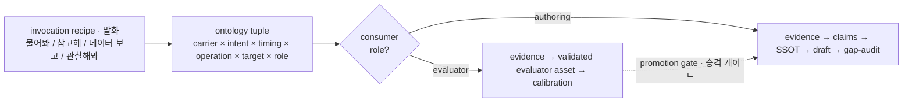

# Document Authoring Cold-Start: Evidence Acquisition and Materialization Patterns

한국어: [cold-start-strategies.ko.md](cold-start-strategies.ko.md)

In document authoring, we look at how to obtain the first material when starting from a blank state (= the *state* where the count of admissible SSOT claims is zero), through two layers. This is not a *classification* — it's an **interpretive frame**.

## Layer 1 — Invocation Recipes (What the User Actually Says)
The user starts with an utterance. Here are the real-world entry patterns and their mapping to operations:
- **"Ask me [questions]"** → operation: `elicit`
- **"Write a draft referencing this"** → `retrieve` (+ `normalize` if needed)
- **"Look at this data, pull out improvements, and plan it"** → `observe-measure` or `retrieve` (depending on the nature of the data) → `synthesize-or-mine` → `derive`
- **"Observe and measure this"** → `observe-measure`

The recipes are **not MECE** — even the same "look at this data" splits along different axes depending on the nature of the data (fresh instrumentation / an existing report / unintentional logs). In practice, multiple recipes are used **simultaneously**. So the recipes are useful **presets**, not mutually exclusive categories.

## Layer 2 — Ontology (What the Recipes Are Parsed Into)
Each recipe is parsed as a combination (tuple) of the axes below.

**Evidence source (not a single origin, but 3 sub-axes)**
- **carrier (medium)**: human / artifact (document) / system / world
- **production-intent (creation intent — judged against the current evidence need)**: purpose-built (created for the current need) / residual (leftover). The same triage memo can be "purpose-built for triage-recording purposes, but residual for later authoring purposes," so this is always judged against the *current episode*.
- **acquisition-timing (acquisition timing — fixed within the current acquisition episode)**: existing / newly-generated. Newly-generated evidence does not become existing just because it was recorded — it only becomes existing for the *next* acquisition episode (it stays fixed within the current episode).
- → triage memo = carrier:artifact + intent:residual (from an authoring perspective) (i.e., "explicit document" and "residue" are different axes, so this is a combination, not an overlap).

**operation (the 6 formal operations)**: `elicit` / `retrieve` / `observe-measure` / `normalize` / `synthesize-or-mine` / `derive`
- `retrieve` (fetching) and `normalize` (normalization) are separate operations.
- `synthesize-or-mine` = synthesizing/mining new propositions or labels from residue or data.
- `derive` = derivation not from a material source but from **constraints, precedent, or axioms** (this is where analogy, first principles, and deduction live). The carrier of the constraint/axiom itself **can be anything** — not just world or human judgment, but also a constraint quoted from a document (=artifact) or a system rule (=system).

**target (output form)**: claims / rules / dataset-labels

**role/consumer (usage — the orthogonal axis that determines the track, can be multi-valued)**: consumed-by-authoring / consumed-by-evaluator / consumed-by-product. A single asset can have multiple consumers at once (e.g., operational telemetry can be both product-data and authoring-evidence). The intended consumer should not be inferred from the recipe alone — it should be received as **explicit parsing context**.

## The Decisive Branch — `role` Determines the Track (Not `target`)


```mermaid
flowchart LR
  rec["invocation recipe · 발화<br/>물어봐 / 참고해 / 데이터 보고 / 관찰해봐"] --> ax["ontology tuple<br/>carrier × intent × timing × operation × target × role"]
  ax --> br{"consumer<br/>role?"}
  br -->|authoring| au["evidence → claims → SSOT → draft → gap-audit"]
  br -->|evaluator| ev["evidence → validated evaluator asset → calibration"]
  ev -. "promotion gate · 승격 게이트" .-> au
```

```
consumer = authoring    →  저작 궤도:   evidence → candidate claims → SSOT → draft → gap-audit
consumer = evaluator    →  평가자 궤도:  evidence → validated evaluator asset(rules | dataset-labels) → audit calibration
                            (하위유형 bootstrap-dataset:  residue → synthesis/labeling → validation → dataset)
consumer = product      →  (제품 데이터 — 별개 자산)
```
**`target` does not determine the track**: an audit rubric has target=`rules`, but consumer=evaluator → evaluator track. A survey dataset has target=`dataset-labels`, but it can have consumer=authoring → authoring track. The artifact's form and its workflow role are orthogonal.

**Promotion = a consumer transition** (independent of the target type): even if an asset was created for the evaluator, it can transition to being an authoring consumer by going through `validated → evidence-backed claims → human promotion gate`.

### The Two Faces of "bootstrap" (Split by role)
- **(a) Building an evaluator dataset** (a reviewer-eval gold set): consumer=evaluator → **evaluator track.** Does not join the authoring track.
- **(b) Mining content propositions from data** (the user's "look at the data, pull out improvements, and plan it" = asistobe-authoring): consumer=authoring → **joins the authoring track.**

Both can have operation `synthesize-or-mine`, and the targets can overlap too — **what splits them is role.**

## Implementation Implications (Presets Only)
`plan --from-{interview|refer|observe}` exists only as a **convenience preset**. The formal contract must be the combination of `carrier/intent/timing + operation + target + role` (a compound task cannot be expressed by a single flag), and the CLI is designed only after the typed output and the role-based promotion gate have been validated.

## What Remains
- This is not a classification but an **interpretive frame**: it parses the recipe (the utterance) into an axis tuple, and splits the track by **role**.
- The MECE completeness of each axis (carrier 4 · intent 2 · timing 2 · operation 6 · target 3 · role 3) needs to be verified separately — especially the completeness of the operation and role lists.
