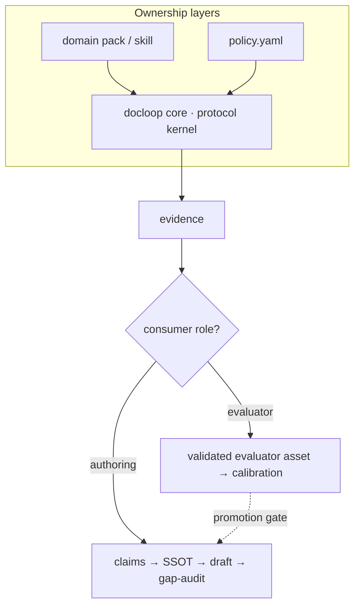

# 설계: 글쓰기에는 오라클이 없다 — 그래서 docloop은 검증 커널이다

English: [design.md](design.md)

## 코딩 하네스 패턴, 그리고 그것이 작동하는 이유

한 물결의 얇은 "코딩 하네스"들이 모델 CLI를 루프로 감싼다: 변경을 생성하고,
점검을 돌리고, 실패를 피드백으로 되먹이고, 초록불이 될 때까지 반복한다. 이들은
의도적으로 작다 — 새로운 런타임도, 맞춤 에이전트도 없다 — 그럴 필요가 없기
때문이다. 지능은 모델이고, 하네스는 그저 루프일 뿐이다.

그 루프가 *수렴하는* 이유는 놓치기 쉽다: **코드에는 오라클이 있다.** 컴파일러와
테스트 스위트는 모델 바깥에 있고, 자신감 있는 산문에 속지 않는다. 하네스가
"완료"라고 말할 때, 객관적인 무언가가 이에 동의한다.

## 글쓰기는 이 패턴을 깨뜨린다

같은 루프를 PRD에 겨누면 무너진다. 스펙에는 컴파일러가 없다. "초안 → 자기 검토 →
수정" 루프는 모델이 모델을 판단할 뿐이라, 모델이 이미 확신하는 바로 그 지점으로
수렴한다. 유창하고, 내적으로 일관되며, 그러면서도 틀릴 수 있다.

그래서 순진하게 그대로 옮긴 "느슨한-PRD, 그냥 계속 돌려라" 방식은 참인지 보장하지
못하는 매끈한 문서를 만들어낸다. PM 글쓰기의 어려운 부분은 애초에 산문 생성이
아니었다. 주장이 현실(코드, 결정, 다른 문서들)과 맞아야 하고, 열린 질문은 눈에
보이게 열려 있어야 한다는 것이다.

더 정확히 말하면: 완성된 문서에는 *단일* 오라클이 없다. 어떤 주장은 모델 바깥의
무언가와 대조해 확인할 수 있지만, 판단은 그럴 수 없다. docloop은 바로 이 이음매를
중심으로 지어졌다.

## docloop의 분할

오라클이 존재하는 척하는 대신, docloop은 문서를 수렴 가능한 부분과 그렇지 않은
부분으로 나눈다.

**수렴하는 부분(루프 + 실제 점검으로 밀어붙인다):**

- **사실 정확성** — 라벨, 열거값, 필수 필드, 동작은 기억이 아니라 근거(코드/스키마)와
  대조해 확인한다.
- **일관성** — `gap-audit`는 소스 종류마다 서브 에이전트 하나를 팬아웃해 문서가
  스스로와, 혹은 하위 산출물과 모순되는 지점을 찾고, 각 모순을 구체적 위치와 함께
  기록한다. 스크립트로 짠 게이트(`gap_audit.py --strict`)는 풀리지 않은 gap이나
  열린 질문이 남아 있으면 통과를 거부한다.
- **독립적 압력으로서의 외부 모델** — `review` 단계는 *다른* 모델(Codex, Gemini,
  또 다른 Claude)이 초안을 공격하게 한다. 이것은 오라클이 아니며, 이 글도 그런 척하지
  않는다: 두 번째 LLM도 첫 번째와 학습 데이터·맹점을 상당 부분 공유하기 때문에, 둘이
  나란히 확신에 차서 틀릴 수 있다. 이는 *진실* 테스트가 아니라 *주의* 테스트다 —
  저자 모델 스스로는 보지 못하는 근거 없는 주장, 모순, 비약을 드러내고 자기 확신의
  루프를 끊는다. 상관된 두 번째 의견이지 근거의 진실은 아니지만 — 오라클이 없을 때
  구할 수 있는 가장 값싼 외부 압력이다.

**수렴하지 않는 부분(사람에게 남겨둔다):**

- **문체와 판단**은 루프 바깥에 머문다. 하네스는 문체를 루프로 다듬지 않는다.
  수렴시킬 대상이 아무것도 없기 때문이다.
- **결정과 승인**은 결코 자동으로 확정되지 않는다. 하네스의 역할은 무엇이 미결이거나
  모순되는지 *드러내고* **멈추는** 것 — gap 리포트와 열린 질문 목록을 사람에게
  넘기는 것이다. 합의를 조작해내는 것은 섹션 하나가 빠진 것보다 더 나쁜 유일한
  실패 모드다.

## 설계에 미치는 결과

- **문서가 아니라 상태로서의 매니페스트.** `manifest.yaml`은 각 섹션의 상태, 출처,
  gap, 결정 기록을 추적한다. 재실행은 멱등이다: 새 근거가 있는 섹션만 바뀐다. 본문이
  SSOT이고, 분할된 페이지와 브리프는 파생물이며 언제나 다시 생성된다.
- **주장이 아니라 근거.** 출처가 없는 주장은 본문에 들어가지 않는다 — 열린 질문
  (미결)이 되거나 gap(근거와 어긋남)이 된다. 하지만 근거가 곧 *진실*은 아니다:
  코드, 스키마, 결정 기록은 조직이 커밋한 것이지 그것이 옳다는 보장이 아니다. 출처가
  서로 충돌하면 docloop은 그 충돌을 드러낼 뿐, 어느 현실이 이기는지 판정하지 않는다.
- **변수 층은 파일이다.** 섹션 순서, 용어집, 어조, Definition of Done은
  `policy.yaml`에 있지, 엔진 안에 있지 않다 — 그래서 같은 하네스가 어떤 조직에나
  쓰인다.
- **구조적으로 반자동.** 스테이징과 모델 호출은 스크립트화돼 있지만, 비평을
  *반영하는* 것은 사람의 게이트다. 잘못된 비평을 무작정 반영하면 회귀이고, 이를
  잡아낼 테스트는 없다.

## 선택적 기여: 더 많은 주의, 여전히 오라클은 없다

옵트인 `contribute → 사람의 응답/자료 → curate → draft-curated` 분기는 관점을
더하지만, 모델 산출물이 많아진다고 해서 진실이나 합의가 생겨난다는 착각은 심지
않는다. 이는 기본 글쓰기 경로와 분리돼 있다: 사용자가 이 명령들을 호출하지 않으면
`plan`, 평범한 `draft`, 매니페스트, SSOT는 기존과 완전히 똑같이 동작한다. 완성된
번들이 있다고 해서 평범한 `draft`가 그것을 찾아 쓰지도 않는다.

`contribute`는 명시적으로 선택한 관점마다 모델 호출을 한 번씩 한다. 한 번의 실행
안의 모든 호출은 동일하게 캡처된 번들 바이트를 겨냥하며, 각 결과는 1대1 색인에
세대(generation)가 표시된 ID를 유지한다. 이는 출처 추적과 반복 가능한 라우팅을
주지, 인지적 독립성을 주지 않는다. 각 호출은 같은 모델 계열과 상관된 가정을 쓸 수
있다. 캡처된 번들은 한 순간에 원자적으로 스냅되는 것이 아니라 시간 구간에 걸쳐
조립되며, 파일시스템 격리나 비밀 유지의 경계가 아니다.

사람과의 경계는 명시적이다. 복사된 응답 파일은 모든 원시 항목을 `decided`,
`supported`, `open`, `carried`, `dismissed` 중 하나로 반드시 분류해야 한다. 빈
입력이나 열린 입력은 결코 결정이 되지 않는다. 선택적 시맨틱 그룹은 운영자
소유다. `curate`는 또 다른 모델 판단이 아니라 결정론적 변환이다: 초안 작성 노트에는
decided와 supported 항목만 포함하고, 열린 질문은 눈에 보이게 미해결로 남기며,
carried와 dismissed 항목은 감사를 위해 보존한다. 매니페스트, 본문 SSOT, 승인은
건드리지 않는다. Attestation은 자기 확인일 뿐이며, 운영자의 신원·저작·권한을
증명하지 않는다.

저장소 프로토콜도 같은 정직성 경계를 뒷받침한다. Run ID는 append-only이고,
목적지는 덮어쓰기 없이 예약되며, `COMPLETE.yaml`은 payload 검증 이후에만
독점적으로 생성된다. 하위 단계는 완전한 인벤토리와 다이제스트를 다시 검증한다.
마커의 존재만으로는 수락이 아니다. 이것은 no-clobber이자 검증된-수락 계약이지,
휴대 가능한 디렉터리 트랜잭션이 아니다: 전원 손실, `SIGKILL`, 같은 UID의 악의적
프로세스, 수동 변조, 네트워크 파일시스템 동작은 여전히 이 보장 밖에 있다. 미완성
번들은 진단을 위해 계속 보이며, 조용히 복구되거나 삭제되지 않는다.

마지막으로, 이 분기는 원본과 보충 자료를 append-only 로컬 번들로 복사하고, 캡처된
내용을 설정된 모델 provider로 보낼 수 있다. 제한된 파일 모드는 우발적인 로컬 노출을
줄여주지만, 암호화, 백업 제외, provider 보존 통제, 동일 사용자 기밀성을 제공하지는
않는다. 제한 사항과 수동 보존 절차는 단순한 운영 조언이 아니라 기능 계약의 일부다.
[기여·큐레이션 가이드](contribute-curate.md)를 참고한다.

## 명시적 review-gate 패킷: 오케스트레이터 없는 프로토콜

옵트인 `review-gate` 명령은 같은 검증-커널 경계를 더 엄격한 리뷰 프로토콜에
적용한다. 이는 패킷을 준비할 뿐, 리뷰를 실행하지 않는다. 이미 `docloop review`
폴더 아래 스테이징된 파일 하나가 선택된 결정 registry, 축(axes), 용어 사전, 문서
모델, 참조된 출처와 함께 동결된다. 검증과 결정론적 스캔은 이 동결된 바이트에
대해서만 실행되므로, 변화하는 살아 있는 입력이 점검 이후 패킷을 조용히 바꿀 수
없다.

v0.13 계약은 결정론적 중간 원장과 패킷에 결합된 최종 receipt, 그리고 선택적이고
범용적인 convention profile/intake preflight를 추가한다. 이들은 여전히 프로토콜
메커니즘이다: drift는 non-blocking한 표현 메타데이터이고, convention 답변은
authority가 아니며, materialization은 나중 run에서 사람이 승인·선택할 수 있는
초안(draft)만 만든다.

패킷은 L1 cold-read, L2 결정 이력, L3 섹션 간 입력을 서로 다른 디렉터리로
분리한다. 이 레이아웃은 운영자를 위한 감사 가능한 가시성 계약이지, 파일시스템
격리도 독립 에이전트의 증거도 아니다. 운영자는 프롬프트를 fresh context에서
실행하고, 결과를 종합하고, 앵커 유실을 점검하고, fresh context에서의
kill/pass/unresolved 검증을 받고, 최종 사람의 결정을 기록해야 한다. 따라서
`prepared`는 오직 완전한 패킷 인벤토리만을 뜻할 뿐, 리뷰가 통과했다거나 문서가
완료됐다는 의미가 결코 아니다.

이 명령은 의도적으로 명시적이고 부가적이다. 일반 리뷰 요청을 가로채지도, 기존
명령을 바꾸지도 않는다. 여전히 상류에서 온 검증되지 않은 약속들은 거부한다:
일반화된 다중 문서 docmodel, severity 순서, 완전한 탐지, 모델 독립성, 그리고
사전 규정된 P1/done 검증자 개수가 실증적으로 정당하다는 어떤 주장도 이 계약 밖에
있다. 실행 가능한 계약과 사람의 계약은 [review-gate 가이드](review-gate.md)를
참고한다.

## 두 번째 사례: 변경계획 모드(as-is/to-be)

이 분할은 PRD 글쓰기에만 국한되지 않는다. **변경계획 모드**는 같은 절단을 다른
작업 — 이미 존재하는 시스템의 수정을 계획하는 일 — 에 적용하며, 오라클 경계를
*문서 하나 안으로* 가져온다:

- **As-is에는 오라클이 있다.** 현재 시스템에 대한 진술("제출 핸들러가 일반적인
  에러를 보여준다")은 확인 가능하다: 코드, 화면, 로그가 그렇게 말하거나 말하지
  않거나 둘 중 하나다. 그래서 ground-audit 게이트는 기계적이다 — 확인된 출처가
  없는 as-is는 막힌다. 잘못된 as-is 위에 세운 to-be가 가장 값비싼 실수이기
  때문이다.
- **To-be는 오라클이 없다.** 목표 상태는 판단이다 — 어떤 트레이드오프, 어떤
  방향 — 이는 손으로 그것을 적용할 사람과 함께 루프 바깥에 남는다.

이것이 이 테제를 가장 깔끔하게 진술한 형태다: "어떤 문서는 오라클이 있고 어떤
문서는 없다"가 아니라, "문서 하나 안에서도 서술적인 절반은 수렴하고 규범적인
절반은 그렇지 않다"는 것이다. 특징적인 단계는 글쓰기 파이프라인에 유사물이 없는
바로 그 단계다 — 관찰을 순서 있는 변경-청크 집합으로 묶는 것(각 청크는 그 순서
안에서 자기 위치에 대한 이유를 명시한다). 왜냐하면 *어떻게 고칠지*의 순서를 정하는
것은 체커가 대신해 줄 수 없는 판단이기 때문이다.

## 언제 쓰지 말아야 하는가

docloop의 수렴하는 다리는 그 주장을 대조할 출처 — 코드, 스키마, 이전 결정 —
가 이미 존재한다고 전제한다. 그래서 이것은 **무언가를 서술하는 글쓰기**를 위한
도구다: 만들고 있는 시스템을 위한 PRD, 매뉴얼, 스펙. 그 가치는 출처의 *양*보다
**권위, 신선도, 커버리지**에 더 크게 좌우된다 — 서명 완료된 결정 기록 하나가
오래되고 서로 모순되는 문서 더미보다 값지다.

**생성적 글쓰기** — 비전, 완전히 새로운 전략, 아직 누구도 취하지 않은 입장을
주장하는 에세이 — 를 겨냥하면, 부담이 큰 주장을 대조할 선행 출처가 없다. 문서
*자체가* 출처다. 여기서는 사실 오라클이 단지 약해지는 게 아니라, 그런 주장에
대해서는 아예 존재하지 않는다. docloop이 깨지지는 않는다 — 그것이 *탐지한*
출처 없는 모든 주장은 열린 질문으로 떨어진다(추출해낸 주장만 라우팅할 수 있을
뿐이다) — 하지만 미결 사항들의 뼈대만 돌려주게 되는데, 이는 곧 이미 알고 있던
것 이상을 알려주지 않는다는 뜻이다. 그 지점의 병목은 사람의 판단이며, docloop은
의도적으로 그것을 자동화하기를 거부한다.

그러니: 위험이 **드리프트** — 문서가 그것이 서술하는 현실과 조용히 어긋나는
것 — 일 때 docloop을 쓴다. **백지**에서는 대조할 대상이 아무것도 없으므로 얻는 것이
적다 — 다만 실제 입력(인터뷰, 결정 기록, 선행 사례)이 있는 완전히 새로운 시도라도
주장을 목록화하고 모순을 드러내는 데는 여전히 쓸 수 있다. 다만 답을 대신 만들어
내지는 못한다.

## docloop이 주지 *않는* 것

미리 정직하게 말해둘 것이 하나 있다: docloop은 문서를 **진실**이 아니라 **선택한
출처 집합**으로 수렴시킨다. 그 집합이 틀렸거나, 오래됐거나, 편향돼 있다면 —
나쁜 결정을 담은 코드, 이미 현실이 앞질러버린 결정 기록 — docloop은 성실하게
더 깔끔하고 더 *확신에 찬* 틀린 문서를 만들어낼 것이다. docloop은 문서와 출처
사이의 거리를 좁힐 뿐, 그 출처를 권위 있고 최신으로 유지하는 것은 사람의 일이며,
가장 중요한 일이다. 근거를 갖춘다는 것은 원래 "모든 주장에 인용이 있다"는 뜻이
아니었다. "모든 주장의 출처가 오늘도 여전히 지지할 만한 것"이라는 뜻이다.

요약하면: **점검할 수 있는 곳에서는 수렴, 그럴 수 없는 곳에서는 사람.**

## 결정 기록(2026-07-14): docloop은 프로토콜 커널이지 범용 문서 엔진이 아니다

docloop은 의도적으로 **공유 검증/실행 프로토콜 커널**로 범위를 한정하며, 전문화된
저작 스킬 계열 뒤에 있는 정본 범용 엔진이 아니다. 핵심을 문서 *의미*의 소유자로
승격시키면 소유권이 흐려지고 프롬프트와 검증 규칙이 여러 층에 중복된다. 결정
사항은 다음과 같다:

- **3층 소유권; 각 규칙은 정확히 하나의 층에만 존재한다.**
  1. *docloop core* — workspace, 매니페스트 상태, 근거/gap 형식, 리뷰 핸드오프,
     게이트, split. 문서 특정적인 것은 아무것도 없이 **실행/검증 프로토콜**만
     소유한다. 경계 판정 기준: **core는 어떤 문서 타입도 import하지 않는다.**
  2. *domain pack / skill* — 문서 온톨로지, 프롬프트, 근거 어댑터, 파생 매핑,
     타입별 검증기와 차단 규칙.
  3. *policy* — 선언적이고 조직별인 제약만.

  core를 문서 *의미*의 소유자로 승격시켜도 그것이 고치려던 정본 중복 문제는
  사라지지 않는다 — 소유권만 흐려지고 프롬프트와 검증 규칙이 양쪽에 남는다. Core는
  **공유 프로토콜**의 정본이지, 스킬들의 정본이 아니다.

- **"일반화 = 전부 `policy.yaml`로 추출한다"는 틀렸다.** `policy.yaml`은 데이터로
  완전히 표현 가능한 변동성에 맞는다(섹션 순서, 용어집, 금칙어, 승인자, 어조,
  정적인 DoD). 출처를 읽는 순서, requirement→screen→manual 매핑, 타입별
  매니페스트 스키마, 조건부 단계, 타입별 검증기의 컨테이너는 *아니다* — 이런 것을
  YAML로 밀어넣으면 타입 없는 DSL, 엔진이 해석해야 하는 숨은 프로그램이 되고,
  "얇은 하네스"는 사라진다. **policy(값/제약)**와 **domain pack(프롬프트/스키마/
  변환/검증기)**은 분리해서 유지한다.

- **이질적인 `derive`(PRD → storyboard → manual)는 core 동사가 아니다.** 오늘의
  `split`은 하나의 본문 SSOT에서 기계적으로, 같은 의미로 재생성하는 것이다. 아티팩트
  간 파생은 시맨틱 매핑, 추적성, 순서, 부분 재생성 정책을 결정한다 — 실행 배관이
  아니라 문서 온톨로지다. 스킬 / domain pack이 **파생 매니페스트**를 작성하고,
  docloop은 그것을 실행하고 출처만 기록한다. derive를 core에 흡수시키면 아티팩트
  registry, DAG 스케줄러, 타입 플러그인까지 끌려 들어온다 — 명백한 스코프 확장이다.

- **`goal`은 게이트 결과의 읽기 전용 집계이지, 수렴 엔진이 아니다.** "문서별 게이트
  통과/실패, 차단 gap 개수, drift 위치, 대기 중인 승인"을 N개 문서에 걸쳐 모으는
  것은 객관적인 상태 관찰이며 오라클 없음 철학에 부합한다. 복합 점수나 "goal %"를
  만들고 모델을 돌려 그것을 올리는 것은 서로 다른 판단 문제 위에 단일 오라클을
  꾸며내는 것이다 — 금지된다. 그 출력 계약은 *게이트 결과 + 출처 + 미해결
  차단요소*로 제한된다. 복합 점수도, 자동 수정도, 자동 승인도, 모델이 판정한
  초록불도 없다. `status`나 `portfolio gate`라는 이름이 `goal`보다 의도를 더 잘
  말해준다. 전제 조건: 오늘의 모델은 단일 본문을 SSOT로 취급하므로, 아티팩트별
  정본/파생/승인 관계는 다중 문서 HUD를 그 위에 짓기 *전에* 먼저 정의돼야 한다.

- **`derive`(쓰기 경로)와 `goal`(읽기 모델)은 서로 다른 책임이며 하나의 표면으로
  합쳐서는 안 된다.** 별도의 얇은 오케스트레이터(`docgraph` 스타일 호출자)가
  domain pack이 선언한 아티팩트 DAG를 순회할 수 있다. docloop은 노드별
  매니페스트/게이트 프로토콜만 제공하고, `status`는 그 동일한 DAG의 매니페스트와
  게이트 결과를 읽는다. 이는 이질적인 파생과 다중 문서 가시성을 여전히 제공하면서
  얇은 실행 계약을 그대로 유지한다.

- **CLI냐 스킬이냐는 "나를 위해서 vs. 남을 위해서"로 결정되지 않는다.** 기준은
  반복 가능성, 환경 독립성, headless/자동화 필요성, 모델/호스트 이식성, 지원
  가능한 버전 관리 계약이지 사용자 수가 아니다. CI/cron/여러 모델 CLI/재현 가능한
  workspace가 필요한 사용자 한 명이라도 독립 CLI를 정당화한다. 하나의 에이전트
  환경에 용접된 다수 사용자 워크플로는 설치형 스킬이 더 나을 수 있다. 공개 OSS라는
  것은 배포 *의도*를 신호할 뿐, 검증된 외부 수요를 뜻하지 않는다.

정제된 입장: **docloop은 공유 검증/실행 프로토콜 커널**이다 — 파생의 의미는
스킬/domain pack에 남고, `status`는 기존 게이트의 읽기 전용 투영으로 남는다.

### 리뷰어 품질은 베테랑 PM 골드셋에 대해서만(평가 시점에만) 측정한다

`review` 단계는 대리 오라클이다. 그 가치는 오직 사람 전문가와의 일치도만큼만
값어치가 있다. 그래서 리뷰어의 품질은 **오프라인**으로, 베테랑 PM 골드셋에 대해
채점한다 — 앞서 리뷰 에이전트를 만들 때 썼던 것과 동일한 "AI 리뷰 vs. 사람 리뷰
일치도" 지표다.

- **두 층위, 하나의 사람 오라클.** 실행 시점에는 문서에 오라클이 없다(L0 → 사람
  게이트, 변함없음). 사람이 *유일한* 오라클이지만, 문서마다 돌리기엔 너무 희소하다
  — 그래서 **평가 시점**에 값싼 기계 리뷰어(L1)를 채점하는 데만 쓰이고, 그 이후
  이 리뷰어가 대규모로 실행된다. 이것은 리뷰어를 캘리브레이션하는 것이지, 결코
  문서를 자동 수렴시키는 것이 아니다.
- **텍스트 유사도가 아니라 finding 단위 일치도.** 지표는 베테랑의 **차단(blocking)
  findings에 대한 recall**(차단 요소를 놓치는 것이 실패 모드다)이며, **precision
  하한선**(제한된 오탐)을 둔다. 산문/임베딩 유사도는 거부한다: 이는 사람의 문체를
  모방하는 것에 보상을 주고, 사람이 놓친 유효한 문제를 리뷰어가 잡아낸 것을
  오히려 감점한다.
- **비대칭적이다.** 베테랑이 놓친 것을 AI가 제기한 유효한 finding은 divergence가
  아니라 중립~긍정이다 — 독립 오라클로서의 가치를 채점에서 깎아내려서는 안 된다.
  일치도는 **게이트이지 목적 함수가 아니다** — 유사도 자체를 직접 최적화하면
  리뷰어가 결함을 잡는 대신 모방으로 수렴하게 된다.
- **이것이 사전 등록된 A/B 베이스라인**이며, 리뷰 렌즈/루브릭/메커니즘을 어떤
  식으로든 바꾸기 전에 peer-review 루프가 요구하는 것이다.
- **상태: 목표는 정해졌지만 아직 가동되지 않음.** 이를 위해서는 베테랑 PM
  골드셋이 필요한데, 아직 존재하지 않는다. 그 골드셋이 생기기 전까지 리뷰 렌즈
  변경은 A/B로 대조할 베이스라인이 없다 — 이는 알려진, 열린 전제 조건이지 이미
  출하된 점검이 아니다.
