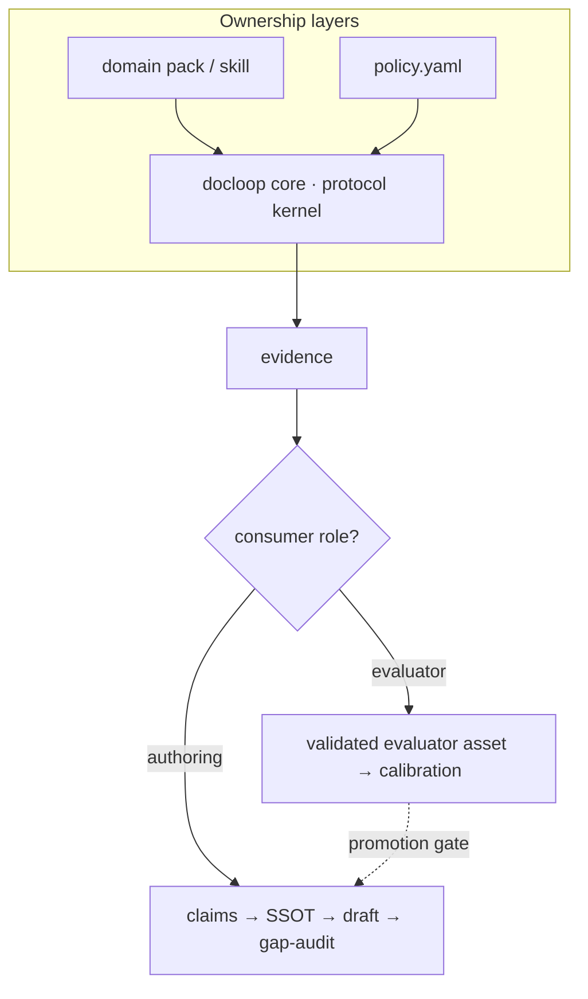

# Design: writing has no oracle — so docloop is a verification kernel

## The coding-harness pattern, and why it works

A wave of thin "coding harnesses" wrap a model CLI in a loop: generate a change,
run the checks, feed failures back, repeat until green. They are deliberately
small — no new runtime, no bespoke agent — because they don't need to be. The
intelligence is the model; the harness is just the loop.

The reason that loop *converges* is easy to miss: **code has an oracle.** The
compiler and the test suite are outside the model, and they are not fooled by
confident prose. When the harness says "done," something objective agrees.

## Writing breaks the pattern

Point the same loop at a PRD and it falls apart. There is no compiler for a spec.
A "draft → self-review → revise" loop has only the model judging the model, so it
converges on whatever the model is already confident about. Fluent, internally
consistent, and possibly wrong.

So the naive port — "lazy-PRD, just keep looping" — produces polished documents
with no guarantee they're *true*. The hard part of PM writing was never prose
generation. It's that the claims have to match reality (the code, the decisions,
the other documents) and the open questions have to stay visibly open.

More precisely: writing has no *single* oracle for the finished document. Some
claims can be checked against something outside the model; judgment cannot.
docloop is built around that seam.

## docloop's split

Instead of pretending an oracle exists, docloop separates the document into the
part that can be made convergent and the part that can't.

**Convergent (drive with loops + real checks):**

- **Factual accuracy** — labels, enums, required fields, behavior are checked
  against the source of truth (the code/schema), not asserted from memory.
- **Consistency** — `gap-audit` fans out one sub-agent per source class to find
  where the document contradicts itself or the downstream artifacts, and records
  each contradiction with a concrete location. Scripted gates (`gap_audit.py
  --strict`) refuse to pass while unresolved gaps or open questions remain.
- **An external model as independent pressure** — the `review` stage has *a
  different model* (Codex, Gemini, another Claude) attack the draft. This is not an
  oracle, and the essay won't pretend it is: a second LLM shares much of the first's
  training and blind spots, so the two can be confidently wrong together. It's an
  *attention* test, not a *truth* test — it surfaces the unsupported claims,
  contradictions, and leaps an author-model can't see in itself, and breaks the
  self-confidence loop. A correlated second opinion, not ground truth — but the
  cheapest external pressure available when no oracle exists.

**Not convergent (keep with the human):**

- **Voice and judgment** stay outside the loop. The harness does not polish style
  in a loop, because there's nothing to converge against.
- **Decisions and approvals** are never auto-confirmed. The harness's job is to
  *surface* what's undecided or contradictory and **stop** — handing a gap report
  and an open-questions list to a human. Manufacturing consensus is the one failure
  mode worse than a missing section.

## Consequences in the design

- **Manifest as state, not the document.** `manifest.yaml` tracks each section's
  status, sources, gaps, and the decision log. Re-running is idempotent: only
  sections with new evidence change. The body is the SSOT; split pages and briefs
  are derivatives, always regenerated.
- **Evidence over assertion.** A claim with no source doesn't enter the body — it
  becomes an open question (undecided) or a gap (evidence disagrees). But evidence
  isn't *truth*: the code, schema, and decision logs are what the org has committed
  to, not a guarantee it's right. When sources conflict, docloop surfaces the
  conflict; it doesn't adjudicate which reality wins.
- **The variable layer is a file.** Section order, glossary, tone, and Definition
  of Done live in `policy.yaml`, never in the engine — so the same harness serves
  any org.
- **Semi-automatic by construction.** Staging and the model invocation are
  scripted; *applying* a critique is a human gate. A wrong critique applied blindly
  is a regression, and there's no test to catch it.

## A second instance: change-plan mode (as-is/to-be)

The split isn't specific to writing a PRD. **Change-plan mode** applies the same cut to a
different job — planning fixes to a system that already exists — and it lands the oracle line
*inside a single document*:

- **As-is has an oracle.** A statement about the current system ("the submit handler shows a
  generic error") is checkable: the code, screen, or log either says it or it doesn't. So the
  ground-audit gate is mechanical — an as-is with no confirmed source is blocked, because a
  to-be built on a wrong as-is is the most expensive mistake there is.
- **To-be doesn't.** The target state is judgment — which trade-off, which direction — and stays
  outside the loop, with the human who will apply it by hand.

This is the cleanest statement of the thesis: not "some documents have oracles and some don't,"
but "within one document, the descriptive half is convergent and the prescriptive half is not."
The distinctive stage is the one with no analogue in the writing pipeline — grouping observations
into an ordered set of change-chunks (each with a stated reason for its place in the sequence),
because ordering *how you fix* is judgment a checker can't supply.

## When not to use it

docloop's convergent leg assumes a source of truth already exists — code, a
schema, prior decisions — for its claims to be checked against. That makes it a
tool for **writing that describes something**: PRDs for a system being built,
manuals, specs. Its value scales less with the *amount* of source than with its
**authority, freshness, and coverage** — one signed-off decision log is worth more
than a pile of stale, conflicting docs.

Point it at **generative writing** — a vision, a net-new strategy, an essay
arguing a position no one has taken yet — and there is no prior source to check
the load-bearing claims against. The document *is* the source. Here the factual
oracle doesn't merely weaken; for those claims it isn't there at all. docloop
won't break — every unsourced claim it *detects* falls to an open question (it can
only route the claims it manages to extract) — but it will hand back a scaffold of
undecideds, which is to say it tells you nothing you didn't already know. The
bottleneck there is human judgment, which docloop deliberately refuses to automate.

So: reach for docloop when the risk is **drift** — the document quietly
disagreeing with the reality it documents. It earns less on a **blank page**,
where there's nothing to converge against — though even a net-new effort with real
inputs (interviews, decision logs, prior art) can still use it to inventory claims
and surface contradictions. It just can't invent the answer.

## What docloop does *not* give you

One thing to be honest about up front: docloop converges a document onto a
**chosen set of sources**, not onto the truth. If that set is wrong, stale, or
biased — code that encodes a bad decision, a decision log that reality has already
overtaken — docloop will faithfully produce a cleaner, more *confident* wrong
document. It shrinks the distance between your document and its sources; keeping
those sources authoritative and current is a human's job, and the most
consequential one. Grounding was never "every claim has a citation." It's "every
claim's source is one you'd still stand behind today."

The summary: **convergence where there's a check, a human where there isn't.**

## Decision record (2026-07-14): docloop is a protocol kernel, not a universal document engine

docloop is deliberately scoped as a **shared validation/execution protocol kernel**,
not the canonical general-purpose engine behind a family of specialized authoring
skills. Promoting the core to own document *meaning* would blur ownership and leave
prompts and validation rules duplicated across layers. The decisions:

- **Three-layer ownership; each rule lives in exactly one layer.**
  1. *docloop core* — workspace, manifest state, evidence/gap format, review
     handoff, gate, split. It owns the **execution/validation protocol**, nothing
     document-specific. Test of the boundary: **core imports no document type.**
  2. *domain pack / skill* — document ontology, prompts, evidence adapters,
     derivation mappings, type-specific validators and blocking rules.
  3. *policy* — declarative, per-org constraints only.

  Promoting core to own document *meaning* does not remove the canonical-source
  duplication it was meant to fix; it just blurs ownership and leaves prompts and
  validation rules on both sides. Core is the canonical source of the **shared
  protocol**, not of the skills.

- **"Generalize = extract everything into `policy.yaml`" is wrong.** `policy.yaml`
  fits variability that is fully expressible as data (section order, glossary,
  banned terms, approvers, tone, a static DoD). It is *not* the container for
  read-order over sources, requirement→screen→manual mappings, per-type manifest
  schemas, conditional steps, or type-specific validators — push those into YAML
  and it becomes an untyped DSL, a hidden program the engine must interpret, and
  the "thin harness" is gone. Keep **policy (values/constraints)** and **domain
  pack (prompts/schemas/transforms/validators)** separate.

- **Heterogeneous `derive` (PRD → storyboard → manual) is not a core verb.** Today's
  `split` is a mechanical, same-meaning regeneration from one body SSOT.
  Cross-artifact derivation decides semantic mappings, traceability, ordering, and
  partial-regeneration policy — document ontology, not execution plumbing. The skill
  / domain pack authors a **derivation manifest**; docloop only executes it and
  records provenance. Absorbing derive into core would drag in an artifact registry,
  a DAG scheduler, and type plugins — clear scope creep.

- **`goal` is a read-only aggregation of gate results, not a convergence engine.**
  Collecting "per-document gate pass/fail, blocking-gap count, drift locations,
  pending approvals" across N documents is objective state observation and fits the
  no-oracle philosophy. Producing a composite score or "goal %" and looping a model
  to raise it would fake a single oracle over distinct judgment problems — forbidden.
  Its output contract is limited to *gate results + provenance + unresolved blockers*;
  no composite score, no auto-fix, no auto-approve, no model-judged green. The name
  `status` or `portfolio gate` states the intent better than `goal`. Precondition:
  today's model treats a single body as the SSOT, so the per-artifact canonical /
  derivation / approval relationships must be defined *before* a multi-document HUD
  is built on top of them.

- **`derive` (a write path) and `goal` (a read model) are different responsibilities
  and must not be fused into one surface.** A separate thin orchestrator (a
  `docgraph`-style caller) can walk the artifact DAG the domain pack declares;
  docloop provides only the per-node manifest/gate protocol; `status` reads that same
  DAG's manifests and gate results. This keeps the thin execution contract intact
  while still giving heterogeneous derivation and multi-document visibility.

- **CLI vs. skill is not decided by "for-me vs. for-others."** The criterion is
  repeatability, environment independence, headless/automation need, model/host
  portability, and a supportable versioned contract — not user count. A single user
  who needs CI/cron/multiple model CLIs/reproducible workspaces justifies a standalone
  CLI; a many-user workflow welded to one agent environment may be better as an
  installed skill. Being public OSS signals distribution *intent*, not verified
  external demand.

The refined position: **docloop is a shared validation/execution protocol
kernel** — derivation meaning stays in skills/domain packs, and `status` stays a
read-only projection of existing gates.

### Reviewer quality is measured against a veteran-PM gold set (eval-time only)

The `review` stage is a stand-in oracle; it is only worth as much as its agreement
with a human expert. So the reviewer's quality is graded **offline** against a
veteran-PM gold set — the same "AI-review vs. human-review agreement" metric used
to build the earlier review agent.

- **Two levels, one human oracle.** At runtime the document has no oracle (L0 → human
  gate, unchanged). The human is the *only* oracle, and it is too scarce to run on
  every document — so it is spent **eval-time** to grade the cheap machine reviewer
  (L1), which is then run at scale. This calibrates the reviewer; it never
  auto-converges a document.
- **Finding-level agreement, not text similarity.** The metric is **recall on the
  veteran's *blocking* findings** (missing a blocker is the failure mode), with a
  **precision floor** (bounded false positives). Prose/embedding similarity is
  rejected: it rewards mimicry of the human's style and penalizes the reviewer for
  catching valid issues the human missed.
- **Asymmetric.** A valid finding the AI raises that the veteran missed is
  neutral-to-positive, not divergence — the independent-oracle value must not be
  scored away. Agreement is a **gate, not the objective function**; optimizing
  similarity directly would converge the reviewer on imitation instead of defects.
- **This is the pre-registered A/B baseline** the peer-review loop requires before
  any review lens / rubric / machinery change.
- **Status: target decided, not yet operational.** It requires a veteran-PM gold set,
  which does not exist yet. Until that gold set exists, review-lens changes have no
  baseline to A/B against — this is a known, open prerequisite, not a shipped check.
